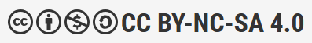
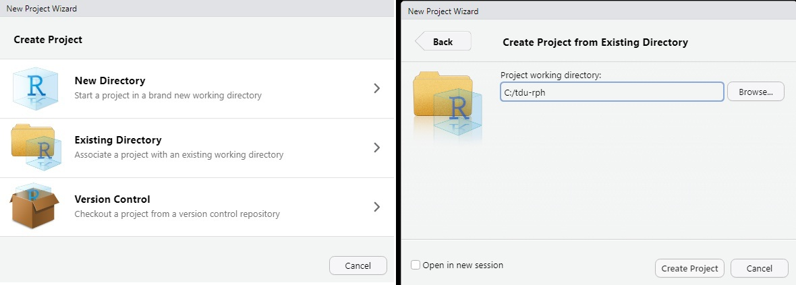

```{r setup, include = FALSE}
library(knitr)

options(
  pillar.width = 80,
  pillar.subtle = FALSE,
  pillar.min_chars = 3
)

opts_chunk$set(
  collapse = TRUE,
  echo = TRUE,
  warning = FALSE, 
  message = FALSE,
  width = 80
)

options(width = 80)

```

## Overview of the course

Welcome to R for Public Health (RPH), the Training and Development Unit's newest offering for 2026.

This site, and the main repository on Github ([tdu-rph](https://github.com/hc-sc/tdu-rph/ "link to Github repository")) will be the primary locations for you to interact with the case study, and access course materials, respectively. You will have already been provided the links for accessing the Course Moodle as well, where you will have access to the course discussion board.

Through three days of interactive, synchronous learning and independent study, we will explore the use of R for several foundational public health activities.

Each day will blend virtual in-class instruction and independent coding time. Though we have tried our best to create a case study that can be followed along independently, instructors will remain available in the virtual classroom during all scheduled independent coding sessions to provide help and technical support if needed.

If you run into issues outside of the scheduled classroom time, please do not hesitate to reach out to us at [ceptraining-formationcmu\@phac-aspc.gc.ca](mailto:ceptraining-formationcmu@phac-aspc.gc.ca "Email us!").

## Copyright statement

Developed by the Training and Development Unit; Regulatory, Operations, and Emergency Management Branch, Public Health Agency of Canada.

Version: February 2026

**Copyright:**

{fig-alt="Image with symbols for creative commons license." fig-align="left"}

[This work is licensed under the Creative Commons Attribution-NonCommercial-ShareAlike 4.0 International License. To view a copy of this license, visit Creative Commons – Attribution-NonCommercial-ShareAlike 4.0 International – CC BY-NC-SA-4.0.](https://creativecommons.org/licenses/by-nc-sa/4.0/deed.en "CC Attribution NonCommercial-ShareAlike 4.0 International")

**Notes:**

As per this license, you may not use this material for commercial purposes such as university courses or or other paid events, workshops, or conferences.

Our materials may be repurposed for other training (for example, targeted training in your organization) with attribution to the Training and Development Unit at the Public Health Agency of Canada as the original source. If you modify, add to or translate the material, please note it briefly when you attribute the Training and Development Unit as the original source.

If you share, re-use or re-purpose our training materials, please inform us via email at ceptraining-formationcmu\@phac-aspc.gc.ca so that we can track the reach of our training materials.

## Requirements

In order to complete this course, you will require the following:

1.  R version 4.4.3.0 or newer
2.  RStudio version 2024.12.1 or newer

## Preamble: Setting-up your workspace

Our hope in delivering these courses focused on R is that after learning the basics, you become comfortable enough to determine your own preferences for how you like to set up and execute your own workflow. With that being said, however, we'll provide some tips here to help get you started if you're not quite sure yet how you would like to interact with our course materials.

### Recommended Setup

We recommend that, if possible, you first create a working directory for the course somewhere on your computer that you have write-access to, but that isn't within the scope of programs like OneDrive. We have found in the past that these automatic version-control programs can cause conflicts with R packages and with running your code. In our experience, it is usually best to create a directory somewhere on your `C:/` drive (e.g., `C:/tdu-rph/`). This will prevent any issues with conflicting versions created between RStudio/R and Windows.

Once you've established a working folder, download the entire participant_data folder from the Github repository and place it inside your working folder (e.g., `C:/tdu-rph/participant_data`). This should simplify working from the case study as much as possible, as we've generally written the examples in a way that pulls from this folder (e.g., `participant_data/module1/examplefile1.txt`).

For keeping ourselves organized, we also generally find it useful to create the following folders in your workspace: 
1. scripts (to keep all your working scripts separated nicely)
2. output (where you would send all the files you created using write commands)
3. data (where you put your data inputs)


Now, open RStudio, and navigate to:

> File \> New Project...

A window will open asking whether you want to start the project in a new or existing directory. Click on *Existing Directory* and select your working folder for RPH (e.g., C:/tdu-rph).

{fig-alt="An image of the project setup wizard in RStudio" width="800"}

Once you've done this, select *Create Project* and an **R project file** will be created inside your working directory, and R will open a fresh session using this project.

::: callout-info

### RStudio Projects

We'll talk more about RStudio projects in the classroom, but essentially they are a file that control behaviours for your R session, and save these behaviours over each working session.

By default, your R Project will:

1.  Restore your environment (.RData) into your workspace at startup;
2.  Save your workspace to .RData on exit; and
3.  Save your R working history (.Rhistory).

You'll notice these files (.RData and .Rhistory) will be created in your R working folder when you create an R project.

Perhaps the most useful thing about working within an RStudio project is that your **default working directory will be set to the location on your computer where the .RProj file is located.** Since we saved it in the same directory as your participant_data folder - then any of our relative file commands in the various modules should work without needing to adjust any of the code.

Default behaviours for both your specific project and global user interface can be adjusted by navigating to:

> Tools \> Project Options...

For more information and a description of various options - see the [RStudio User Guide section on RStudio Projects](https://docs.posit.co/ide/user/ide/guide/code/projects.html#project-options "RStudio Projects").


:::


Great! Now you should be ready to proceed with the next step of the course.

## Installing required packages

You may recall that base R only includes a minimal set of packages. For this course, we want to extend our capabilities, which will therefore require that we install some additional packages so that you can experience the wild and wonderful world of coding for data science that R has to offer.

At it's simplest, the syntax for installing a new package to your computer looks something like this:

> install.packages("name of package goes here")

So if we wanted to, we could run this same line of code for every package that we want to install. Then, each time we open R, we'd have to invoke each of these packages that we plan on using by including this next line of code at the top of our scripts for each package that we want to load:

> library(name of package)

I don't know about you, but to me, this feels a little tedious. Surely as we become pirate-wizards of the R universe, we can think of something a little more streamlined to help us install and load the packages we need for our exercises? Fret-not! The friendly and helpful R community has already thought of something to make this process as painless as possible, and put together a "package-manager" for us to help make our lives that much easier.

This package-manager, named 'pacman' (get it?), includes the function *p_load()* which checks to see if the package you want is installed, and either finds/installs/loads it for you if you haven't installed it previously, or just loads it into your session if you have already installed it. Clever, right?

With this in mind, all we need to do is first install the *pacman* package using the old boring way, then let the p_load function take care of the rest for us!

In your R script, type out and execute the following code:

```{r Install and load Pacman}
#Only run install.packages the first time for pacman
#install.packages("pacman") 

library(pacman)
p_load(tidyverse)
```

Henceforth, (I think I used that word correctly?), you can now install and/or load previously loaded packaged by simply using the `p_load()` function.

We've tried to limit the packages needed as much as possible for RPH, but you will need to install the ones listed here. For the modules in this course, you'll need to `p_load()` the following packages:

1.  pacman (`install.packages("pacman")`)
2.  tidyverse (`pacman::p_load(tidyverse)`)
3.  tinytex (`pacman::p_load(tinytex)`, then once it is installed, run `tinytex::install_tinytex()`)

The tinytex package will need two steps to install. You'll first need to install tinytex, then use the install_tinytex() command. This will install a minimal version of LateX on your computer, and allow you to render documents as PDF in Module 4. If you're confused - don't be afraid to ask about it in the virtual classroom.

(Note that using `pacman::` and `tinytex::` just avoids any issues of not having the package currently loaded in your environment.)

## Working with the course material

The RPH course has been written to permit approximately 50% of your time in discussion, lecturettes and group activities in the virtual classroom, with the remaining 50% working independently through the case study.

We've done our best to embed as many explanations and resources as possible directly into the case study to make it interesting and easy-to-follow. That being said, you'll notice as we move into later modules that instructions may start to come with less detail in the latter materials when they require code that has already been explained. This has been done with intent, to encourage you to attempt more of the R coding on your own. Instructions may therefore be provided with one of three levels of demonstration/support:

1.  (*First demonstration*) We provide the code directly in the examples for you to rewrite or copy/paste into your own R script. There may be some small changes required (e.g., object naming) but generally we're directly showing you what to do.
2.  (*Second+ demonstration*) We ask you to strategize and execute an operation that you've already seen, and provide the code in a hidden drop-down. This is intended to allow you to try the code out yourself first, then compare how your coding approach may have differed from ours.
3.  (*Third + demonstration / Challenge*) You may find toward the end of the course that there are a couple of instructions where we don't actually provide you with the explicit code you'll need to complete the instruction. This is intended as a challenge to have you reflect on the examples and instruction already provided, and use these to build the code on your own. Don't worry - your instructors will be able to help you if you do get stuck!

### Access to case study materials and downloads

The case study itself exists on this website. You can navigate between Modules 1 - 4 using the tabs at the top of the screen. The navigation bar on the right-hand side of the page displays the headers throughout the current page.

At the bottom of the navigation bar is a link to download the materials in MS Word format. If you find yourself wanting to take notes directly in the case study material, or would like to retain these materials for future use - then please use this link to download them directly. We will not otherwise be providing handouts of the course case study.
