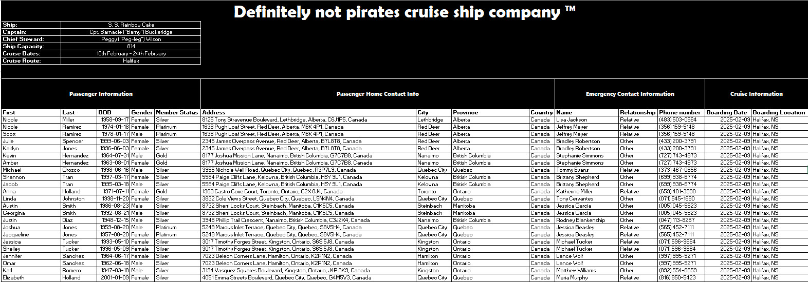
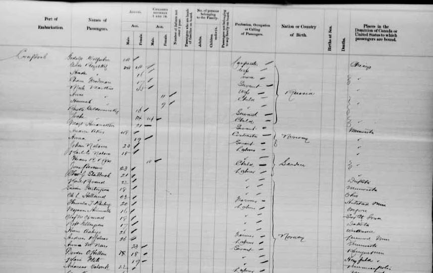

```{r setup, include = FALSE}
library(knitr)

options(
  pillar.width = 80,
  pillar.subtle = FALSE,
  pillar.min_chars = 3
)

opts_chunk$set(
  collapse = TRUE,
  echo = TRUE,
  warning = FALSE, 
  message = FALSE,
  width = 80
)

options(width = 80)

library(pacman)
library(tidyverse)


```

## Module 1 Learning objectives

Ahoy!

Welcome to the first module of ArrrrrrPH! These modules are designed to provide foundational and experiential learning components of the TDU's R for Public Health course. By working through the module, and following along with the reasoning provided, we hope that you'll come away not only with a bit of coding muscle-memory, but also a stronger grasp of the reasoning behind why we make certain choices when it comes to working with data and coding.

Everything that you need to complete the case study for the course should be included in these modules, but they do assume a beginner-to-intermediate working competency in R. If you have any issues getting the code to work - do not hesitate to reach out to one of your course facilitators for help.

### Learning objectives

By the end of Module 1, you will be able to

1.  Build tidyverse workflows using the **%\>%** operator
2.  Discuss best-practices for tidy (clean) datasets
3.  Apply tidyverse functions to a complex dataset

Now that you've dipped your toes into the seas of R coding, the ship's steward has sent you the passenger manifest to work on next. As a savvy epidemiologist, however, you know that you'll need to review and clean the data before setting sail on any analyses.

For this module, you'll be required to identify parts of the manifest that need correction before using it for any coding analyses, and fix these issues using tools available to us as part of the Tidyverse collection of data-manipulation packages.

## Loading our first dataset

Let's try loading our first dataset.

For this, we'll be using a *function* from the *Tidyverse* package. In order to do this, we'll need to make sure that we've first loaded the *Tidyverse* into our working session.

Type the following into your R script.

```{r Install and load Tidyverse}
p_load(tidyverse)

```

Great - now we have all of the different functions from Tidyverse available to use! For this course, we'll only be using a very small number of the total available functions, but if you want to check out all that the Tidyverse has to offer, you can review the [included packages here](https://tidyverse.org/packages "Tidyverse Packages").

Let's take a look inside the folders for **Module 1** - there should be three:

1.  data/
2.  scripts/
3.  output/

Inside the data/ folder you'll find the dataset for module 1, which is saved as an excel workbook. We'll want to convert this to an easier format to deal with later, but first let's try loading the file into R and having a quick look at what we're working with here!

In order to read the excel file directly into your computers memory without any format changes, we'll use the **readxl** package, which, lucky for us, works great with tidyverse. However, the package is **not** included in tidyverse, so we'll need to install and load it into memory separately. 

Try installing and loading **readxl**, then using the function *read_excel()* to load the file "ship_manifest.xlsx"

```{r Read Excel File}
readxl::read_excel("participant_data/module1/ship_manifest.xlsx")
```

Okay, something appears to not be working as expected here. Let's open the file in Excel and see what's going on...

::: callout-warning

{#pic_passmanifest fig-alt="An image of a data table showing a large header section"}

::: 

Yikes!

When will these fictional-nautical-based-tourism-that-definitely-aren't-pirates-companies ever learn to make their data collection forms friendly with machine-readable tools?

Okay but all kidding aside - get used to it! Navigating strange formatting issues is a highly-useful skill that will come in handy many times in your public health career!

## Tidy data and R

When we interpret tables in R, the software is expecting consistent columns, each containing a unique variable, with the top row of all the columns containing a name for each variable. If we look a little more closely, we can actually see that this is the case for the useful data in the form, however, we first need to tell R to remove, or skip, the rows of the form that do not contain useful information.

Fortunately, this is pretty easy to do with our **read_excel()** function. Review the function help using the following line of code.

> help(read_excel)

This should pop up the help file in the bottom right pane in RStudio, where you'll see the following under the function usage:

> read_excel(\
> path,\
> sheet = NULL,\
> range = NULL,\
> col_names = TRUE,\
> col_types = NULL,\
> na = "",\
> trim_ws = TRUE,\
> skip = 0,\
> n_max = Inf,\
> guess_max = min(1000, n_max),\
> progress = readxl_progress(),\
> .name_repair = "unique"\
> )

The argument that we're interested in is **skip = 0**. If we include this argument in our **read_excel()** function, then R will automatically skip the number of rows indicated. Let's try running the code again, but this time, skipping over the first 10 rows of the worksheet.

We'll also save the file to an object called 'manifest' so we can easily modify and use it later on.

```{r}

manifest <- readxl::read_excel("participant_data/module1/ship_manifest.xlsx", 
                               skip = 10)


```

## Identifying data cleaning needs

Let's take a moment now to review the **manifest** object and learn a little about it. There are several functions that can help you become familiar with data objects. Because we're mainly focused here on using as many **Tidyverse** functions as possible, let's check out the function *glimpse()*. This function operates very similarly to the base R **structure** function *str()*, however, provides the output in a more neatly organized way. Try it out on the **manifest** object you imported earlier.

```{r}
glimpse(manifest)

```

Take a few minutes to further explore the data however you see fit, and jot down any characteristics about the dataset that you think might pose a problem later on. When you're done that, review the code provided below and note how your data-cleaning process compared to ours.

**A few tips to keep in mind when looking for potential data issues:**

1.  Are variables named consistently and without spaces or special characters?

2.  Are the data contained within each variable consistent? I.e., only one data type per variable?

3.  Are there missing values within any of your variables? What about sentinel values like those in the following table? How will you plan to treat these?

    | Value or symbol | Description                                                                                                                                                                     |
    |-------------------------|-----------------------------------------------|
    | .               | Period. Often used to denote purposely missing values in programs like Stata.                                                                                                   |
    | \-              | Dash. Can denote missing value, negative, empty cell, or errors.                                                                                                                |
    | 999             | Three nines (999). This code is often used to represent 'missing' or 'unknown'.                                                                                                 |
    | N/A             | Not applicable. This is sometimes written purposively, and other times is an automatic replacement for blank cells.                                                             |
    | *Missing*       | The word 'missing.' This is often input manually by someone who wants signify that the data were not collected, and that an empty cell is not the result of a data entry error. |
    | (blank)         | Blank cell. Impossible to know whether a cell was left intentionally blank, or whether it is the result of data entry errors.                                                   |

    : Table of sentinel values

4.  How are dates formatted?

5.  How do you want place names to be formatted? E.g., should provinces be spelled out in full, or is it easier to replace these with abbreviated versions?

6.  Are there extraneous variables in the data? If yes, what do you propose doing with these?

------------------------------------------------------------------------

When you're ready - let's move on and see how your findings compared to ours! Below is a list of issues that we found with the passenger manifest table.

<details>

<summary><strong>Click to show the list</strong></summary>

-   Once the header information was removed to make the file human-readable, we lost the information about whether variables were capturing **passenger information**, or **emergency contact information**. As a result, we now have duplicated variable names! This will not do! We'll need to remove or change the variables names to ensure that each one is unique and informative. While we're at it - we should make sure that none of our variables contain special characters or spaces in them too.

-   In the **DOB** variable, there appears to be multiple different formats. We'll need to fix this as this is a very important variable if we want to know the passenger's age.

-   Speaking of age.. it looks like someone was trying to use an Excel formula to calculate it - but pretty quickly ran into a snag due to some incorrect formatting in the DOB column, resulting in a lot of "#N/A" inputs. We'll want to replace the current **Age** variable with a corrected version.

-   **Province** of residence appears to have quite a number of different formats going on, between fully-spelled-out versions of province names and abbreviated versions. We'll need to capture the unique set of these, and ensure that we take a consistent approach.

-   Emergency contact information appears to have undergone some input issues as well. Even though the variables are supposed to include **first** and **last** names, it appears that titles and professional designations somehow made it in, and is causing some issues. Also - there are quite a few missing entries, so we'll need to make some decisions on what to do with these data.

-   **Boarding Date** for some reason has the date written out in a non-date format. We should probably fix this as well.

</details>

## Data cleaning steps

Now that we have our list, let's get started on cleaning the dataset so that it can be useful for future cross-referencing whenever we need to look up something about our passengers.

### Step 1: Rename variables

```{r}

# First, let's get a list of all the variables currently included in the manifest dataset

vars <- names(manifest)

print(vars)


```

There appears to be two problems happening here:

1.  First...1 and Last...2 versus First...11 and Last...12 - we'll need to fix these so that they make more sense and are easier to work with.
2.  Several variables include spaces in their naming, so we'll fix that too.

```{r}
#Create a new variable that includes the corrected names of variables for the passenger manifest:

fixed_vars <- c("pass.fname", 
                "pass.lname", 
                "pass.dob",
                "pass.age",
                "pass.gender", 
                "pass.status",
                "home.address",
                "home.city",
                "home.prov", 
                "home.country",
                "emerg.contact.fname",
                "emerg.contact.lname",
                "emerg.contact.relationship",
                "emerg.contact.phone",
                "board.date",
                "board.location")

# Replace the variable names in the dataset with the corrected versions: 
names(manifest) <- fixed_vars

# Print the names and double check that it worked! 
names(manifest)


```

Excellent, we can cross the first item off of our list: fixing variable names. Next, let's look at the date of birth variable.

### Step 2: Fix date of birth

```{r}

#Let's have a look at the data in the dob variable: 

glimpse(manifest %>% select(pass.dob))


```

Wait a second.. oh no. Excel again..

So it turns out, that by reading these data in directly from Excel, we have retained some Excel-scurvy! Dates in excel are formatted in a very unique way: it simply counts the number of days passed starting with "1" on January 1, 1900.

We'll need to use a few extra tricks it seems to fix this issue. But first, lets strategize a couple different ways to do this.

1.  The easiest, is probably to reopen the file in Excel - fix the few dates that aren't formatted the same as the majority, and then re-write all the dates in a non-date format in Excel. This is an R course, though, so we're not going to do that!
2.  As alluded to in the above suggestion, we should first focus on making all the data in the variable consistent, then do some operation on all them at once. We can do this easily enough in R, and using a scripting language helps us keep track of everything we did, compared to Excel where we can get distracted and forget to record our steps. Win win.

```{r}

# Let's start by printing the entire DOB variable and checking which entries need fixing: 

birthdates <- manifest$pass.dob
print(birthdates)

```

If we look through the data, there's actually only 5 entries with issues:

-   Entry 14 - Aug 21, 1992

-   Entry 97 - Aug 30, 1982

-   Entry 127 - Mar 9, 1993

-   Entry 155 - Jan 13, 1959 (let's assume the order of month and day were mixed)

-   Entry 568 - Jul 18, 1968

These are all easy to fix if we stick with indices that we learned about in R-basics.. but we'll need to convert these dates into Excel format first, then revert everything into a more sensical format once everything is numeric.

We'll want to convert the intended date to a class that we can deal with numerically, then extract the number of days between that date and the beginning of 1900-01-01 to get the date as an excel format. Lubridate makes this pretty easy for us with the ymd() function!

```{r}
# library(lubridate)

birthdates[14] <- ymd("1992-08-21") - ymd("1899-12-30")
birthdates[97] <- ymd("1982-08-30") - ymd("1899-12-30")
birthdates[127] <- ymd("1993-03-09") - ymd("1899-12-30")
birthdates[155] <- ymd("1959-01-13") - ymd("1899-12-30")
birthdates[568] <- ymd("1968-07-18") - ymd("1899-12-30")

print(birthdates) # check to make sure everything looks OK

```

Now that we've created a new variable with the correct Excel formats, let's convert it into the correct date format, and save the whole variable back to the manifest.

```{r}

# Use as_date() from lubridate, and set the Excel origin
# We'll need to change our birthdates back to numeric first, as well. 

birthdates <- as_date(as.numeric(birthdates), origin= "1899-12-30")
manifest$pass.dob <- birthdates

# Doublecheck to make sure that the DOB column now looks good: 
glimpse(manifest)
```

Now you can see that the pass.dob variable contains all dates in an actual date format. Hurrah!

### Step 3: (Re-)Create an age variable from DOB

After the shenanigans involved in the last step, this should be an absolute sea-breeze. Let's recreate the age variable in our dataset, using the passenger date of birth, and the date that the cruise set sail as the day to calculate age.

The way that we treat age can be a little tricky, so it's best to break it down into smaller steps, working backwards like so:

1.  Calculate the time interval passed between the date of birth and the departure date of the *S.S. Rainbow Cake*

> interval(pass.dob, ymd("2025-02-10"))

2.  Get the exact length of that interval, and return the value in years

> time_length(interval, "years")

3.  Round that value down to an integer

> floor(time_length)

4.  Save this as a new variable in your manifest data frame

> mutate(pass.age = ...)

Try coding these all into one statement on your own, then check against our code below!

```{r}

manifest <- 
  manifest %>% 
  mutate(
    pass.age = floor(
      time_length(
        interval(pass.dob, ymd("2025-02-10")),
        "years")
      )
  )


```

::: callout-note
## Did you know

Historic passenger manifests from naval crossings in the late 19th and early 20th centuries are available at the [Library and Archives Canada website](https://www.bac-lac.gc.ca/eng/discover/immigration/immigration-records/passenger-lists/passenger-lists-1865-1922/Pages/introduction.aspx "Passenger lists 1865-1922")? You can search the passenger database using dates, ports of departure and arrival, and ship names!

{fig-alt="A photograph of a ships manifest from the late 19th century"}

Here's an example of a meticulously-collected and beautifully hand-written data set - imagine having to clean and digitize all these records!
:::

### Step 4: Fix Province variable

We noted already that the Province variable (e.g., **home.prov**) appears to have been entered inconsistently! Some entries have the full name of the province spelled out, some abbreviated, some abbreviated multiple ways.. needless to say, this needs to be fixed and put into a consistent format, so let's practice that now.

The first thing we'll want to do is check the variable and extract a list of all the different ways that provinces have been coded. If we were to do this with all the observations in our dataset, though, we'd end up with a very long list that included a lot of redundant entries. Instead - let's create a non-redundant list first, using another handy tidyverse function: **distinct()**.

To do this, we'll invoke our manifest dataframe, select the "home.prov" variable, then call the distinct() function. E.g.,

```{r}
manifest %>% 
  select("home.prov") %>% 
  distinct()

```

Based on the above output, we have 19 different versions of province names included, but we definitely do not have 19 different provinces in Canada! You'll notice as well that Quebec sometimes has an accent, and sometimes does not. Let's propose to simplify things, and in our final dataset, just use 2-letter abbreviations for provinces.

This does mean that we'll need to identify all the variations present for each province, then replace them with the abbreviated version. To make sure that we can review and verify, we'll create a new variable with these replacements first, then overwrite our old variable once we've checked and verified that things are done correctly.

#### The case_when function

Our current operation is a great time to practice the case_when() function. This function will end up coming in very handy over and over again, so its a good chance for us to get well-acquainted with it now.

The function case_when looks for observations or rows in your dataset that evaluate some condition being true, then returns a value when this is found. If you have ever played with "if...then" statements or used the **ifelse()** function in R - then this will feel very familiar to you. In our scenario - we have observations that may appear to satisfy one of a number of cases, and when this occurs, we want to return another value. We just have to type them out using the following syntax:

> case_when(conditional statement 1 \~ value to return if true,
>
> conditional statement 2 \~ value to return if true,
>
> conditional statement 3 \~ value to return if true,
>
> ...(continue with as many statements as you need)
>
> TRUE \~ value to return if above conditions are FALSE)

```{r}
manifest <- 
manifest %>% 
  mutate(home.prov.abb = case_when(
    home.prov == 'BC' ~ 'BC',
    home.prov == 'British Columbia' ~ 'BC',
    home.prov == 'AB' ~ 'AB',
    home.prov == 'Alberta' ~ 'AB',
    home.prov == 'SK' ~ 'SK',
    home.prov == 'Sask' ~ 'SK',
    home.prov == 'Saskatchewan' ~ 'SK',
    home.prov == 'MB' ~ 'MB',
    home.prov == 'Manitoba' ~ 'MB',
    home.prov == 'ON' ~ 'ON',
    home.prov == 'Ontario' ~ 'ON',
    home.prov == 'QC' ~ 'QC',
    home.prov == 'Quebec' ~ 'QC',
    home.prov == 'Québec' ~ 'QC',
    home.prov == 'NS' ~ 'NS',
    home.prov == 'Nova Scotia' ~ 'NS',
    home.prov == 'PEI' ~ 'PEI',
    home.prov == 'Prince Edward Island' ~ 'PEI',
    home.prov == 'New Brunswick' ~ 'NB',
    home.prov == 'NFLD' ~ 'NL',
    home.prov == 'Newfoundland and Labrador' ~ 'NL',
    TRUE ~ "missing"
    ))


```

Now, to check whether or not we missed any provinces in the list, let's filter our new variable, looking for instances of the 'missing' entry that we specified as our catch-all.

```{r}

manifest %>% 
  filter(home.prov.abb == 'missing')

```

Since our filter returned zero rows of the home.prov.abb variable that were 'missing' (and nothing returned NA), we can rest knowing that our variable is complete. Now we'll replace the home.prov variable with the one that we created, and remove the temporary variable from the dataset.

Note: in this example, we'll use the select() function with a negative operator to specify which variables to drop.

```{r}

manifest <- 
  manifest %>% 
  mutate(home.prov = home.prov.abb) %>%
  select(-home.prov.abb)

```

### Step 5: Emergency Contact Information

Looking through the emergency contact information, we can see that there are several issues with the character strings taking place.

1.  There are several missing and marked as NA (not much we can do about these at the moment).
2.  When a name includes a professional designation (like "D.D.S.") then this gets added to the person's last name. We'll ignore the strangeness of people using their dentist as their emergency contact, and focus on fixing these for the sake of clean data entry only.
3.  When a name is prefixed with a title (e.g., "Dr.") the prefix becomes the contact's first name, and has pushed first and last name into the same variable.

#### The stringr package

Issues within variables that contain character-strings are a perfect opportunity to practice with functions from the **stringr** package. No need to load anything new - **stringr** contains some very useful data-cleaning tools for character data, including the function [str_replace()](https://stringr.tidyverse.org/reference/str_replace.html "Replace character matches with new text") which will allow us to modify character strings using a *pattern* and *replacement* strategy.

Since we want to affect all the entries in the variable, we'll use the version of the function str_replace_all() which can modify all entries at once, rather than seeking just the first entry that meets our criteria. The inputs for str_replace_all() are as follows:

> ```         
> str_replace_all(string, pattern, replacement)
> ```

-   *string* = the variable containing character strings you wish to modify

-   *pattern* = the pattern you want to replace

-   *replacement* = the character string to be used as the replacement

Let's use the function now to modify the emergency contact first and last name fields. We need to remove the titles "Mr.", "Mrs.", and "Dr.", so we'll just replace them with an empty string: "". We'll do the same thing to the suffixes in the last-name field, replacing DDS and Jr. with "".

You'll notice in the code below that we use a double-escape (\\\\) before a period. This is because stringr functions use **regex** (regular expressions) conventions as wildcards, and the period (.) is a wildcard for *anything*. So if we didn't escape the character '.' in 'Dr.' for example, then R will look for the string 'Dr' followed by any string of any length, and we don't want that.

[Regex](https://regexlearn.com/cheatsheet "Regular expressions cheatsheet") is a deep and powerful toolset that we encourage you to check out, should you be interested in it, however, we will not be covering it any further in this course.

Let's try writing out the code for prefixes and suffixes. We'll call our manifest dataframe, use mutate() to let R know we're affecting change on a variable, in this case emerg.contact.fname and emerg.contact.lastname, then specify our string replacements using str_replace_all().

```{r}
manifest <- 
manifest %>%
  mutate(emerg.contact.fname =
           str_replace_all(
             string = emerg.contact.fname,
             pattern = "(Mr\\.|Mrs\\.|Dr\\.)",
             replacement = "")
         ) %>%
  mutate(emerg.contact.lname = 
           str_replace_all(
             string = emerg.contact.lname,
             pattern = "(DDS|Jr\\.)",
             replacement = "")
         )

```

Great work! We're almost done with this step, all that is left to do now, is to fix the squished names present in the emerg.contact.lname variable. Let's discuss two approaches.

1.  We *could* spend some time figuring out a regular expression to separate text based on letter case. In this instance, we would be looking for the position in the string that changes from lower case to upper case. E.g., DavidSmith –\> David \| Smith. However, remember that we're applying this function to the entire variable, and if our syntax isn't 100% correct, we could inadvertently introduce more errors into the mix.
2.  Instead, we recommend fixing the entries explicitly, using the exact examples that need fixing. This may seem slightly more tedious, but in this example, it is far safer, and will save us from a lot of headache if our code in option 1 doesn't function the way we expect it to.

With this in mind, lets specify the first-names we want to replace in the emerg.contact.fname variable based on the emerg.contact.lname variable, then fix the last names once that's done.

```{r}
manifest <- 
manifest %>% 
  mutate(emerg.contact.fname = 
           case_when(emerg.contact.lname == "DavidSmith" ~ "David",
                     emerg.contact.lname == "GeorgeBooker" ~ "George",
                     emerg.contact.lname == "DouglasEvans" ~ "Douglas",
                     emerg.contact.lname == "JacobScott" ~ "Jacob",
                     emerg.contact.lname == "ToniAvila" ~ "Toni",
                     TRUE ~ emerg.contact.fname
                     ),
         emerg.contact.lname = 
           case_when(emerg.contact.lname == "DavidSmith" ~ "Smith",
                     emerg.contact.lname == "GeorgeBooker" ~ "Booker",
                     emerg.contact.lname == "DouglasEvans" ~ "Evans",
                     emerg.contact.lname == "JacobScott" ~ "Scott",
                     emerg.contact.lname == "ToniAvila" ~ "Avila",
                     TRUE ~ emerg.contact.lname))

```

### Step 6: Fix boarding date.

The last thing to do to get our dataset into tip-top shape is to fix the **boarding date** variable. Since there's only two variations in this one (e.g., Feb 9th and Feb 10th) this should be an easy fix using our case_when() function. Keep in mind, however, that we may want to be able to use this variable in calculations later, so we should also restore it to a date format using Lubridate's **ymd()** function.

Let's wrap these together into one operation:

```{r}
manifest <- 
manifest %>% 
  mutate(board.date = case_when(
    board.date == "Feb 9th" ~ ymd('2025-02-09'),
    board.date == "Feb 10th" ~ ymd('2025-02-10'),
    TRUE ~ NA)
  )
  
```

### Saving your dataset to disk

Have a look through your dataset with the **view()** function, and make sure that everything looks correct. When you're ready to save the final dataset to a file on your computer, use the **write_csv()** function like so:

> write_csv(dataset, "name_to_save_as.csv")

## Summary

Congratulations! At this point, you have successfully cleaned up the ship's manifest, enabling further analysis, and recording a number of really important transformations.

You managed to do all of the following, using only tidyverse functions:

1.  Read a complex excel file and store it as a data frame object
2.  Remove egregious excel-formatting from the header of the file
3.  Fix variable names
4.  Fix individual data entries within variables
5.  Fix dates
6.  Fix complex strings
7.  Write a file to disk.

That's a lot! We even managed to sneak a small preview of regular expressions in there!

## Quiz

Let's do a quick review of the **Tidyverse functions** we used in this module:

```{=html}
<style>
/* Strong reset for quiz elements so theme CSS doesn't interfere */
.quiz, .quiz * { box-sizing: border-box; }

/* Layout for each choice: radio + text */
.quiz .choice {
  display: flex;
  align-items: center;
  gap: 0.6rem;
  margin-bottom: 6px;
  line-height: 1.25;
}

/* Ensure the input does not collapse or overlap text */
.quiz .choice input[type="radio"] {
  flex: 0 0 auto;
  min-width: 1.05rem;
  min-height: 1.05rem;
  width: 1.05rem;
  height: 1.05rem;
  transform: scale(1.05);
  margin: 0;            /* remove theme margins that can misalign */
  vertical-align: middle;
}

/* Text next to radio - wraps correctly */
.quiz .choice span {
  flex: 1 1 auto;
  display: block;
  word-break: break-word;
  margin-left: 0;       /* guard against theme padding on labels */
}

/* Buttons / spacing */
.quiz button {
  margin-top: 6px;
  margin-bottom: 12px;
}

/* Feedback styling */
.quiz .feedback {
  margin-top: 6px;
  font-weight: 600;
}
</style>
```
<div class="quiz">

<!-- Q1 -->

<p><strong>1. What does <code>mutate()</code> do?</strong></p>

<label class="choice"><input type="radio" name="q1" value="A">Removes rows from a data frame</label> <label class="choice"><input type="radio" name="q1" value="B">Creates or modifies columns</label> <label class="choice"><input type="radio" name="q1" value="C">Joins two datasets</label> <button onclick="check('q1','B')">Submit</button>

<p id="q1-feedback" class="feedback">

</p>

<hr>

<!-- Q2 -->

<p><strong>2. In <code>case_when()</code>, what does the final <code>TRUE \~ x</code> line usually mean?</strong></p>

<label class="choice"><input type="radio" name="q2" value="A">Convert TRUE values to missing</label> <label class="choice"><input type="radio" name="q2" value="B">Leave unmatched values unchanged</label> <label class="choice"><input type="radio" name="q2" value="C">Drop all rows that evaluate to TRUE</label> <button onclick="check('q2','B')">Submit</button>

<p id="q2-feedback" class="feedback">

</p>

<hr>

<!-- Q3 -->

<p><strong>3. What does <code>ymd()</code> from lubridate do?</strong></p>

<label class="choice"><input type="radio" name="q3" value="A">Converts strings into Date objects using year–month–day order</label> <label class="choice"><input type="radio" name="q3" value="B">Extracts the year from a date</label> <label class="choice"><input type="radio" name="q3" value="C">Randomly shuffles date values</label> <button onclick="check('q3','A')">Submit</button>

<p id="q3-feedback" class="feedback">

</p>

<hr>

<!-- Q4 -->

<p><strong>4. What is a common use of <code>str_replace_all()</code>?</strong></p>

<label class="choice"><input type="radio" name="q4" value="A">Replace all occurrences of patterns in a string</label> <label class="choice"><input type="radio" name="q4" value="B">Split a string into tokens</label> <label class="choice"><input type="radio" name="q4" value="C">Convert character vectors to factors</label> <button onclick="check('q4','A')">Submit</button>

<p id="q4-feedback" class="feedback">

</p>

<hr>

<!-- Q5 -->

<p><strong>5. What does <code>select()</code> do?</strong></p>

<label class="choice"><input type="radio" name="q5" value="A">Filter rows based on a logical condition</label> <label class="choice"><input type="radio" name="q5" value="B">Choose columns to keep, drop, or rename</label> <label class="choice"><input type="radio" name="q5" value="C">Convert a data frame into long format</label> <button onclick="check('q5','B')">Submit</button>

<p id="q5-feedback" class="feedback">

</p>

<hr>

<!-- Q6 -->

<p><strong>6. What does <code>distinct()</code> return?</strong></p>

<label class="choice"><input type="radio" name="q6" value="A">All duplicated rows</label> <label class="choice"><input type="radio" name="q6" value="B">A data frame with unique rows (or unique combinations of selected columns)</label> <label class="choice"><input type="radio" name="q6" value="C">A list of duplicated column names</label> <button onclick="check('q6','B')">Submit</button>

<p id="q6-feedback" class="feedback">

</p>

<hr>

<!-- Q7 -->

<p><strong>7. What does a lubridate <code>interval()</code> represent?</strong></p>

<label class="choice"><input type="radio" name="q7" value="A">A sequence of equally spaced dates</label> <label class="choice"><input type="radio" name="q7" value="B">A duration of time measured in seconds</label> <label class="choice"><input type="radio" name="q7" value="C">A precise time span with a fixed start and end datetime</label> <button onclick="check('q7','C')">Submit</button>

<p id="q7-feedback" class="feedback">

</p>

<hr>

<!-- Q8 -->

<p><strong>8. What does <code>glimpse()</code> do?</strong></p>

<label class="choice"><input type="radio" name="q8" value="A">Prints the structure of a data frame in a horizontal, tidy format</label> <label class="choice"><input type="radio" name="q8" value="B">Creates a histogram of numeric variables</label> <label class="choice"><input type="radio" name="q8" value="C">Converts a data frame into a tibble</label> <button onclick="check('q8','A')">Submit</button>

<p id="q8-feedback" class="feedback">

</p>

</div>

```{=html}
<script>
function check(questionName, correctValue) {
  const answer = document.querySelector(`input[name="${questionName}"]:checked`)?.value;
  const feedback = document.getElementById(`${questionName}-feedback`);

  if (!answer) {
    feedback.textContent = "Please select an option.";
    feedback.style.color = "orange";
    return;
  }

  if (answer === correctValue) {
    feedback.textContent = "Correct! ✔️";
    feedback.style.color = "green";
  } else {
    feedback.textContent = "Incorrect. Try again.";
    feedback.style.color = "red";
  }
}
</script>
```
