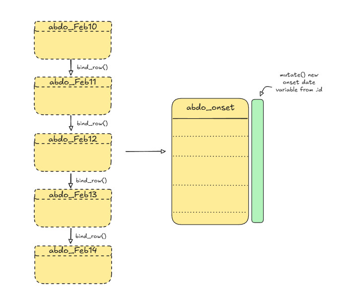
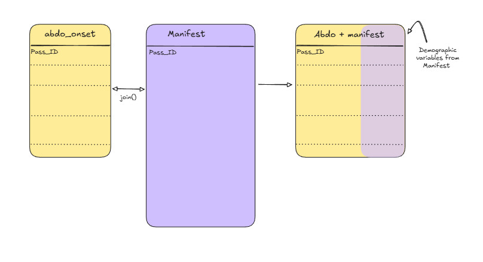
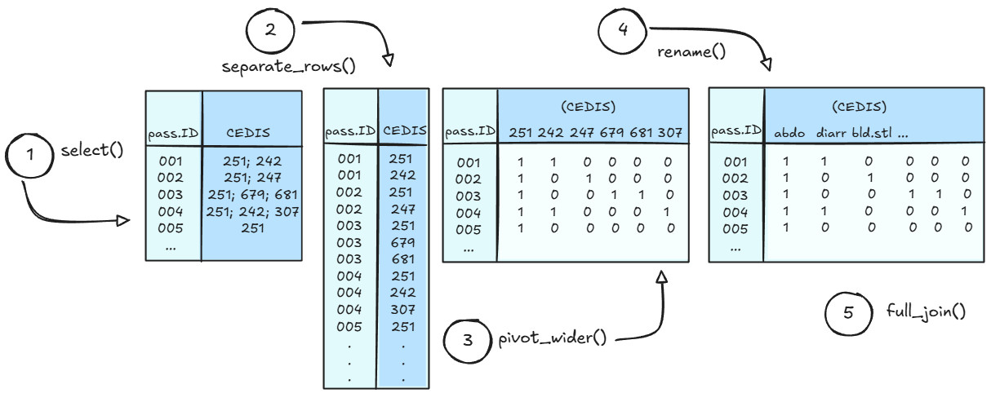

```{r setup, include = FALSE}
library(knitr)

options(
  pillar.width = 80,
  pillar.subtle = FALSE,
  pillar.min_chars = 3
)

opts_chunk$set(
  collapse = TRUE,
  echo = TRUE,
  warning = FALSE, 
  message = FALSE,
  width = 80
)

options(width = 80)

library(pacman)
library(tidyverse)

```

Welcome back!

So far in the course, we've gotten used to navigating our datasets using Tidyverse functions.

In this module, we'll be practicing another critical skill: working with multiple datasets!

## Scenario update

Blarney! It's a good thing that D.N.P. cruise-lines thought to hire an epidemiologist for their voyage! Passengers with symptoms of abdominal pain or worse have been reporting to the ship's infirmary like crabs to catfood! Something isn't sitting well on this boat, and you've got a sneaky suspicion that you might be facing an on-board outbreak.

You can't make bricks without clay, however, and we cannot make conclusions without evidence. We'll need to do some basic epidemiology to assess if there are any commonalities between the sick passengers before we can report our recommendations to the captain.

Thankfully, the ship's nurse has been quite co-operative and provided you with the records of individuals that have reported to the infirmary over the last few days. Upon opening the email and giving it a quick scan, however, you realize that *none of the demographic information* (e.g., age, sex) has been included in the data. In fact, it turns out that the nurse aboard the S.S. Rainbow Cake takes *personal data confidentiality* VERY SERIOUSLY, and passenger names aren't even included!

Instead of names, passenger health data have been coded to use a personal identification number (PIN). Lucky for us, the nurse keeps a copy of the ship's manifest, and recorded a PIN for each passenger, but these datasets are separate, and you'll need to find a way to combine them in order to figure out who's who! Good thing you've been practicing data appends and joins!

## Learning Objectives

By the end of Module 3, you will be able to

1.  Describe your plan for combining multiple datasets together.
2.  Combine multiple datasets using Tidyverse syntax.
3.  Explain use-cases for several different types of data-join operations.

## Part A: Exploring datasets and mapping out a data collation plan

In this module, you've been given several datasets that you'll want to combine in order to calculate some summaries.

First, however, you'll need to review what data you've been provided with, and formulate a strategy for combining datasets in a way that makes most sense for the types of analyses you'll want to do.

### Abdo datasets

In your **Module3** datsets folder you should see the following files, that correspond to data extracts related to passengers with abdominal pain complaints:

> **abdo_Feb10.tsv**
>
> **abdo_Feb11.tsv**
>
> **abdo_Feb12.tsv**
>
> **abdo_Feb13.tsv**
>
> **abdo_Feb14.tsv**

Each of the **abdo\_** files are formatted the same way and contain data collected on a single date. These files were extracted from the infirmary's database, and contain several rows of metadata at the top of the file that you'll want to filter out. They also all contain the following variables:

| Variable             | Definition                                                                      |
|----------------------|--------------------------------------------------|
| Pass_ID              | Unique identifier given to ship passengers                                      |
| Recorded temperature | Oral temperature taken during medical visit (degrees celsius)                   |
| Recorded height      | Passenger height measurements taken during medical visit (cm)                   |
| Recorded weight      | Passenger weight measurement taken during medical visit (kg)                    |
| CEDIS                | CEDIS Chief complaint code, input by nurse at check-in (see additional handout) |

: Data dictionary for data extracts from the ship infirmary

### Passenger manifest

The ship's nurse has also provided you with a copy of their passenger manifest - which thankfully has the Pass_ID included, as well as the demographic information you'll need to summarize the epidemiology of passengers experiencing symptoms of illness.

Also - lucky us, it seems as though the ship's infirmary does a **much** better job of maintaining the passenger manifest as well! So we shouldn't have to worry about cleaning it a second time. There are, however, more variables than we really need for answering our questions about who is getting sick - so we'll want to focus just on the variables pertinent to our analysis. Lets focus on keeping the following:

| Variable      | Definition                                                                               |
|---------------------|---------------------------------------------------|
| Pass_ID       | The unique identifier given to each passenger by the crew of the S. S. Rainbow Cake.     |
| Age           | Age of the passenger at the time of the cruise departure.                                |
| Gender        | Reported gender of the passenger.                                                        |
| Member status | Which tier of rewards member. May determine access to different amenities or food items. |
| Boarding date | What date the passenger boarded the cruise ship.                                         |

: Variables to keep from the passenger manifest

### Data collation plan

Now that we have an idea about what our datasets will look like, we should sketch out a strategy for how our data sets can be joined together. Starting with our **abdo** datasets: these are all in the same format, but separated out for each day. We'll want to **append** these datasets together, and **create a new variable** to indicate what the date was that the symptoms were reported.

For our append operation, we'll be using the following function:

> `bind_rows(dataset1, dataset2, etc..., .id = "id")`

Simply, bind_rows will combine our data by stacking the rows on top of each other. Its important to ensure that all the column names are consistent, otherwise we'll get a messy bunch of rows with mostly NA's in them.

The argument .id="id" will produce a new column that contains a character string of the filename. This will then let us identify which observations were recorded on each day, and we can then **mutate()** a new column based on this to represent the onset date.

{fig-alt="A simple data-flow diagram showing five data sets combining into one."}

Once we have a working **abdo dataset** in place, we can turn our attention to the **passenger manifest file**. This manifest has already been cleaned by the ship's staff, and contains the unique passenger ID variable that we can use as a key variable. The dataset is, however, still saved as an Excel workbook, and contains the messy header and extraneous variables - so you'll need to revisit how we imported this properly in Module 1 if you've forgotten, and then select the variables to keep from the table above. When that's done, we'll join the two tables together with the key variable.



::: callout-important
Make sure that you think about what table join is the most appropriate for the end result you're hoping to achieve! Also, the **order** that you specify the tables matters with some table joins! If you need help remembering how each of the different join types work, refer to the references on [mutating joins](https://dplyr.tidyverse.org/articles/two-table.html?q=filtering%20joins#mutating-joins "Link to dplyr mutate joins") and [filtering joins](https://dplyr.tidyverse.org/articles/two-table.html?q=filtering%20joins#filtering-joins "A link to dplyr filtering joins")!
:::

### Code-along for Part A

If you're feeling confident, then we encourage you to try establishing the code yourself for this exercise. However, we've provided the code that we used below. Remember, there's always multiple ways to accomplish the same thing, so don't worry if your code doesn't always match what we've done!

#### Importing and appending the Abdo datasets

```{r}

# Load required libraries
# library(pacman)
# p_load(tidyverse)


# create a vector to store consistent and simple variable names for abdo datasets
abdo_names <- c("pass.ID", "pass.temp", "pass.height", "pass.weight", "CEDIS")


# load abdo datasets using read_tsv from the readr tidyverse package: 
abdo_feb10 <- read_tsv("participant_data/module3/abdo_Feb10.txt", col_names = abdo_names, skip = 4)
abdo_feb11 <- read_tsv("participant_data/module3/abdo_Feb11.txt", col_names = abdo_names, skip = 4)
abdo_feb12 <- read_tsv("participant_data/module3/abdo_Feb12.txt", col_names = abdo_names, skip = 4)
abdo_feb13 <- read_tsv("participant_data/module3/abdo_Feb13.txt", col_names = abdo_names, skip = 4)
abdo_feb14 <- read_tsv("participant_data/module3/abdo_Feb14.txt", col_names = abdo_names, skip = 4)

```

Great! Notice that we used skip = 4 to remove the header row, since we've stipulated our own headers in the abdo_names vector.

Next, let's append these datasets together using the **bind_rows()** function.

```{r}

abdo_combined <- bind_rows(abdo_feb10,
                           abdo_feb11,
                           abdo_feb12,
                           abdo_feb13,
                           abdo_feb14,
                           .id = "id")

```

Now that we have our combined abdo dataset, we can go ahead and mutate a new column based off our 'id' variable that was created when we used bind_rows. For this, we'll revisit the case_when and ymd functions as well from Module 1.

```{r}
abdo_combined_onset <- 
abdo_combined %>% 
  mutate(onset.date = case_when(
    id == "1" ~ ymd('2025-02-10'),
    id == "2" ~ ymd('2025-02-11'),
    id == "3" ~ ymd('2025-02-12'),
    id == "4" ~ ymd('2025-02-13'),
    id == "5" ~ ymd('2025-02-14')
  ))
```

Now we can drop the "id" variable from our abdo_combined_onset dataset, and proceed to joining this dataset with our passenger manifest.

```{r}

abdo_combined_onset <- 
  abdo_combined_onset %>% select(-id)

```

Before moving onto the passenger manifest, however, let's clean up our workspace and remove the temporary objects that we created up till now.

```{r}

rm(abdo_combined, abdo_feb10, abdo_feb11, abdo_feb12, abdo_feb13, abdo_feb14, abdo_names)

```

Great - we should be just left with the **abdo_combined_onset** object in your work session now.

#### Importing the passenger manifest

Now that we have our abdo dataset all ready to go, we can turn our attention to the updated passenger manifest file. In your Module 3 data folder, you should find the following file:

> pass_manifest.xlsx

First, open this file in Excel and give it a look-through. It should look very familiar to the manifest that you worked on in Module 1, but the data cleaning issues identified in Module 1 have been cleaned up and the passenger ID variable has been added. Remember, you'll still need to remove the header while importing this file!

```{r}
# Import the dataset using readxl
# Note the readxl::read_excel allows for you to access functions from installed 
# packages without loading the entire package. 
pass_manifest <- readxl::read_excel("participant_data/module3/pass_manifest.xlsx", 
                            skip = 10)

```

Now, recall earlier that we determined that we didn't need to keep all of the data from the passenger manifest, so let's use the select() function to choose only the variables that we want to keep.

```{r}
pass_manifest_trunc <- #truncated, temporary object
pass_manifest %>% 
  # Note that we wrap variables with spaces in a back-tick
  select(Pass_ID, Age, Gender, `Member Status`, `Boarding Date`)

```

We should have everything we need now to join these two datasets together!

#### Deciding on a join type to combine the two datasets

Now that we're at the stage where we will actually join these datasets together, we need to carefully consider which join type we'll want to use. Remember that there are both mutating joins - which change the data, but don't drop observations, and filtering joins, which DO drop observations.

To help you decide which join you want - think through the following questions:

1.  What question are you ultimately trying to answer?
2.  Do you *need* all the data from both datasets?
3.  Which dataset contains the observations most important to you, and which dataset contains the supplementary information you're trying to add?

<details>

<summary><strong>Click to see our decision and reasoning</strong></summary>

For this operation, we decided that a **left_join** would work best!

-   A left join (**left_join()**) keeps all rows from the left (first) data frame, and adds matching columns from the right data frame based on the join key(s).

-   If a row in the left data frame has no matching key in the right, the new columns are filled with NA.

-   Rows in the right data frame that don’t match any left-side keys are dropped and do not appear in the result.

-   Since we're interested in the cases reporting abdominal symptoms primarily, and we're looking to add supplementary demographic data, the left join makes the most sense, and keeps the results nice and tidy for us, without any extras.

::: callout-warning
Don't forget that the order of tables matters when invoking **left_join()**.
:::

</details>

#### Joining the final abdo and passenger manifest datasets

This is it! We've made it to the step where we finally get to join these datasets together into one, using the join type that we decided upon. Let's take a quick look at the syntax for left_join().

> `left_join(x, y, by = ...)`

-   *x* is the table for which all the rows will be kept
-   *y* is the table that you want to *add data* from
-   *by* is an optional argument that specifies the key value to join the datasets on. Since we have "pass.ID" in the abdo dataset, and "Pass_ID" in the manifest, we have to let R know that these are common variables between the two tables.

```{r}

# Time to join these datasets together! 

abdo_manifest <- left_join(abdo_combined_onset, pass_manifest_trunc, by = c("pass.ID" = "Pass_ID"))


```

## Part B: Separating, pivoting, and rejoining data

Let's recap where we're at so far:

1.  According to our abdo_manifest dataset, as of Feb 14th, we have 69 passengers aboard the S.S. Rainbow Cake who have fallen ill, reporting symptoms of abdominal pain or worse.
2.  We have established onset dates for each of the ill passengers by appending the individual abdo datasets together and establishing the date that they reported to the ship infirmary as a variable in our dataset.
3.  By joining the combined abdo dataset with a version of the passenger manifest that has a unique identifier assigned to each passenger, we were able to securely import demographic variables and attach them to the appropriate passengers.

Recall the reason that we completed these steps was so that we could produce some epidemiological summaries about the sick passengers, and establish whether or not there may be commonalities between symptoms and some characteristics about the individuals.

At present, we have our dataset of cases who reported at least abdominal pain, we've established their onsets from the reporting date, and we've joined our data with the demographic variables present from the passenger manifest!

Now it's time that we address the manatee-in-the-room: the CEDIS variable! All of our symptom data are actually being stored in this one variable, coded using the **Canadian Emergency Department Information Systems** approach! Nurse Hookhand has once again shown her flair for data management!

::: callout-note
### Did you know

The Canadian Emergency Department Information System (CEDIS) is a Canadian initiative to provide a systematic approach to data collection across hospital emergency departments nation-wide. The system was established through a collaborative, consensus based approach, and included input from hospital nurses, administrators, and researchers all across Canada. The goals of the approach were to create a system of systematically capturing and categorizing chief complaints in emergency departments and triage settings to facilitate clinical care, research and emergency department management with a specific, Canadian healthcare-system context.

Cool facts about CEDIS:

-   CEDIS presenting complaint data are commonly used for syndromic surveillance systems (e.g., in Yukon, Yukon’s ED-SyS uses CEDIS codes from real-time ED data).

-   Public health applications often rely on presenting complaints because they are completed promptly at triage, whereas discharge diagnosis codes may lag or be incomplete. Evidence from BC COVID-19 ED use analysis notes that CEDIS presenting complaints often have more complete coverage and are used for surveillance.

-   CEDIS is integrated into NACRS for national reporting, enabling linking to other health administrative data.

**References**

Innes G, Murray M, Grafstein E. A consensus-based process to define standard national data elements for a canadian emergency department information system. *Canadian Journal of Emergency Medicine*. 2001;3(4):277-283. doi:10.1017/S1481803500005777

Bouchouar E, Hetman BM, Hanley B. Development and validation of an automated emergency department-based syndromic surveillance system to enhance public health surveillance in Yukon: a lower-resourced and remote setting. BMC Public Health. 2021 Jun 29;21(1):1247. doi: 10.1186/s12889-021-11132-w. PMID: 34187423; PMCID: PMC8240073.

Yao, J., Irvine, M. A., Klaver, B., Zandy, M., Dheri, A. K., Grafstein, E., & Smolina, K. (2023). Changes in emergency department use in British Columbia, Canada, during the first 3 years of the COVID-19 pandemic. *CMAJ*, *195*(34), E1141–E1150. https://doi.org/10.1503/cmaj.221516

Canadian Institute for Health Information. (2025). National Ambulatory Care Reporting System (NACRS) metadata. https://www.cihi.ca/en/national-ambulatory-care-reporting-system-nacrs-metadata

Canadian Association of Emergency Physicians. (n.d.). Canadian Emergency Department Information System (CEDIS). https://caep.ca/resources/cedis/
:::

### Converting the CEDIS variable into useful symptom data

While there is undoubtedly rich information contained in the CEDIS variable, we're going to have to think through what type of operations we'll need to extract and use the information provided. Let's list some considerations below.

1.  CEDIS codes are stored as 3-digit numbers. We have provided a PDF of the numeric translation in the folder for Module 3. You will need to translate the codes into the symptoms they represent in order to make sense of the data and summarize the reported symptoms.

2.  Codes are stored in a single variable, and multiple codes have been separated by a semi-colon. We'll need to separate these out first into separate variables to facilitate using them in summaries.

3.  Not everyone reported the same number of symptoms, so whatever we do for the step above needs to ensure that the correct symptom code is reported to the correct variable, and only that variable.

We'll start by tackling steps 2 and 3 first, then go back and figure out step 1.

### Planning our approach

Tidyverse has some very useful functions that will enable us to separate out values from our CEDIS value and redistribute them into their own variables. We'll walk through and explain some example code here - but as always, feel free to skip ahead and attempt to figure out the coding on your own if you feel comfortable doing so! There are more sophisticated and quicker ways to perform the operations than what we'll show here, so if you have a better way to get the same results with the CEDIS data, please do so!!

Conceptually the approach that we'll take will follow something like this:

1.  We'll start by working with a simplified subset of our data that only includes the passenger ID (**pass.ID**) and the **CEDIS** variables.
2.  We'll turn each **pass.ID** x **CEDIS** code into a separate row (i.e., multiple rows per individual, with only one CEDIS code present in the CEDIS variable) using the **separate_rows()** function.
3.  We'll then use the **pivot_wider()** function to stretch the CEDIS data from long-format into wide-format.
4.  We'll rename the variables based on the associated symptoms.
5.  Finally we'll re-join these data back to our original table.

{fig-alt="A diagram showing multiple tables resulting from data manipulation"}

### Code-along for Part B

First, we'll start by saving a temporary subset of our abdo-manifest object that contains only the pass.ID and CEDIS variables. This will help to ensure that we don't mistakenly manipulate other variables in our dataset accidentally.

```{r}


CEDIS_subset <- abdo_manifest %>%
  select(pass.ID, CEDIS)

```

#### Apply separate_rows()

Easy enough, next, let's check out the arguments we'll need to specify in the **separate_rows()** function:

> separate_rows(data, ... , sep, convert)

-   data = the data frame we want to modify (this is already handled with the %\>% operator)

-   ... = tidy-select columns we want to target

-   sep = the character used to separate the values we want to split up (e.g., ";")

-   convert = (T/F) this tells R whether or not we want to convert the resulting columns into whatever class the individual values are. For example, the CEDIS variable is presently stored as a character string because it mixes both numeric and character values. If we set convert = T, then the separated CEDIS codes will be treated as numeric, and if we set convert = F, then they'll stay as characters.

::: callout-warning
Note: the Tidyverse team has marked **separate_rows()** as end of lifecycle / deprecated. This doesn't mean that the function won't continue to work, but it does mean that the team will not continue to update it. The function that is intended to replace it is called **separate_longer_delim()**, however, it is still in experimental status, so we won't official move to that one until a later time.
:::

Let's hit the CEDIS variable with our separate_rows() function and see what we get!

```{r}
CEDIS_subset_long <- 
CEDIS_subset %>%
  separate_rows(CEDIS, sep = ';', convert = FALSE)

#view(CEDIS_subset_long)

```

#### Apply pivot_wider()

Now we can use the pivot_wider() function to create new variables based on the values present in the CEDIS variable.

> `pivot_wider(id_cols, names_from, values_from, values_fill)`

-   id_cols = the key or identity variable, in this case, pass.ID
-   names_from = the variable containing the names that will be used for new variables
-   values_from = the variable that contains the data you want to use to fill in under the new variable headings
-   values_fill = a 'fill' value to be used to fill in the missing observations (e.g., 0, NA, etc.)

::: callout-warning
Note: **pivot_wider()** assumes that each combination of the *id_cols* and *names_from* variables is unique. If duplicates exist in your dataset (e.g., two instances of pass.ID = 001 and CEDIS = 251), you must specify a function using values_fn() to define how those duplicate values should be handled (e.g., **max** for presence/absence, **sum** for counts).
:::

```{r}
CEDIS_subset_wide <- 
CEDIS_subset_long %>% 
  mutate(value = 1) %>%
  pivot_wider(id_cols = pass.ID,
              names_from = CEDIS,
              values_from = value,
              values_fill = 0)


```

#### Rename() variables

On to the easy part! We now just have to rename the CEDIS codes into useful variable names!

Take a few minutes to review the CEDIS table that was provided in your participant folder and note down the symptoms that correspond with each of the codes.

<details>

<summary><strong>Click to see the codes</strong></summary>

Just kidding! You didn't think we'd do all the work for you, did you?

Take a break from your RStudio console and give the PDF a quick read, you should be easily able to find the symptoms that correspond to the following CEDIS codes:

-   251
-   254
-   257
-   260
-   404

</details>

::: callout-info
Need a short brain-break? Every thought about the differences between R and Python? [Here's a short video where Posit's Chief Data Scientist, Dr. Hadley Wickham, talks about R versus Python.](https://youtu.be/mVzDPxKagxk?si=rJ9qpjkkFkiqDk8d "Hadley Wickham on R versus Python")

{fig-alt="An image featuring the branding logos of R and Python coding software"}
:::

Ok - on to the coding step. If you ***still*** haven't looked up the codes at this point - then follow along and see how we decided to rename the variables.

The rename() function allows you to specify exactly which variables you want to rename, and uses a "new.name" = "old.name" syntax. When you're working with more complex datasets, or in the middle of a series of operations, its generally much safer to rename variables this way.

```{r}

symptoms_table <- 
CEDIS_subset_wide %>% 
  rename("abdo.pain" = "251",
         "vomiting" = "257",
         "diarrhea" = "254",
         "bloody.stool" = "260",
         "headache" = "404")


```

#### Join() with main dataset

Finally it's time to join our symptoms data back with our main manifest!

Let's go ahead and re-unite these data, using the pass.ID as the key variable! Note that this time, since the key variable is named the same in both datasets, we don't actually need to specify the variable in our list of function arguments.

```{r}

symptoms_manifest <- full_join(symptoms_table, abdo_manifest)

# Remove all but the specified objects from memory
#rm(rm(list = setdiff(ls(), c("symptoms_manifest"))))

```

Review your symptoms manifest object to ensure that everything looks in order. Once that's finished, clean up your workspace, removing any of your temporary/intermediate data objects.

## Part C: You're an epidemiologist, remember?

Alright - up until now we've focused primarily on cleaning and manipulating data, which are *essential* skills for an epidemiologist to have. However, you were hired aboard the **S. S. Rainbow Cake** because you're an epidemiologist and are trained to think about how data are used to solve public health issues, so let's turn our focus now to exploring what are our data are telling us.

We need a tool to help turn our observations into meaningful summaries, and the summarize() family of functions will provide just that!

The **summarize()** function takes your specified data and summary functions (e.g., sum, mean, median, max, min, etc.) as input, and outputs a new data frame with the results stored as variables. The syntax should look fairly familiar at this point.

e.g.,

> `data %>% summarize(`
>
> `summary_mean = mean(variable),`
>
> `summary_median = median(variable),`
>
> `summary_example3 = some.function(variable),`
>
> `etc.`
>
> `)`

A very useful supplement to summarize() functions is the ability to group your data prior to the summaries being calculated. This allows you to create a summary of one variable for each level of another variable. E.g., calculating the median age for females and males separately.

You can group variables in one of two ways.

1.  Using the `.by =` argument inside the summarize() function. E.g., adding `.by = Gender` will split your data into groups of males and females only before carrying out the summary function indicated.
2.  Using group_by() before invoking summarize() in your tidyverse pipe operations. E.g.,

> `data %>%`
>
> `group_by(grouping.variable) %>%`
>
> `summarize(mean = mean(summary.variable),`
>
> `median = median(summary.variable),`
>
> `etc.)`

Let's list some summaries that we may be interested in, then work up an example using summarize().

**Simple statistics to summarize:**

1.  Mean, median and range of ages for all cases

2.  Numbers of total male and female cases

3.  Numbers of passengers with fever (e.g., \> 38 degrees Celsius)

4.  Total numbers of cases reporting

    -   Vomiting

    -   Diarrhea

    -   Headache

    -   Bloody stool

#### Mean, median and range of ages

Let's first look at a description of cases in the data:

```{r}

symptoms_manifest %>% 
  summarize(.by = Gender,
    mean_age   = mean(Age, na.rm = TRUE),
    median_age = median(Age, na.rm = TRUE),
    max_age    = min(Age, na.rm = TRUE),
    min_age    = max(Age, na.rm = TRUE)
  )


```

It doesn't appear that there are any differences in the age distribution of female and male cases based on what we see here.

#### Number and proportions of female vs. male cases

Next, let's tally the total number of female and male cases, and calculate their proportions as well.

```{r}

symptoms_manifest %>% 
  group_by(Gender) %>%
  summarize(Total = n(),
            Proportion = n()/sum(Total))

```

Whoops! What do you notice above about our results? The proportion is returning the total number of female cases out of the total number of female cases, and vice-versa for males. This is because our .groups remain in effect in the summarize() function until we say otherwise. To get the correct proportions, we'll need to adjust our code.

```{r}

symptoms_manifest %>% 
  group_by(Gender) %>%
  summarize(Total = n(), .groups = "drop") %>%
  mutate(Proportion = Total / sum(Total))

```

In the above summarize() call, we've told R that groups should be dropped in the result, and then used the `Total` variable to mutate a new variable that returns the proportion of the sum of the total for each female and male cases. This time, it works as expected.

#### Cases reporting with Fever

For this one, we'll use mutate a new variable called "Fever" based on the temperature values, and then calculate the summaries based on that. Let's go with anything over 38 degrees constituting a fever.

```{r}

symptoms_manifest <- 
  symptoms_manifest %>% 
  mutate(Fever = case_when(
    pass.temp > 38.0 ~ 1, 
    pass.temp <= 38.0 ~ 0, 
    TRUE ~ NA
  ))


symptoms_manifest %>% 
  count(Fever)


```

Hmm. Interesting - a little over half of our cases with abdominal pain were running a fever. Lets create some age groupings so that we can look a little more closely at age breakdowns.

```{r}
symptoms_manifest <- 
symptoms_manifest %>%
  mutate(
    age.group = case_when(
      Age < 12 ~ "0–11",
      Age < 18 ~ "12–17",
      Age < 30 ~ "18–29",
      Age < 50 ~ "30–49",
      Age < 65 ~ "50–64",
      Age >= 65 ~ "65+",
      TRUE ~ NA
    )
  )


symptoms_manifest %>%
  group_by(age.group) %>%
  count(Fever)
  
```

::: callout-note
It looks like ages 30-49 were experiencing fever most frequently. Does this give us any clues at this stage as to what we might be dealing with? Why or why not?
:::

Now let's look at our remaining symptoms by gender and by age group:

-   Vomiting
-   Diarrhea
-   Headache
-   Bloody Stool

```{r}

symptoms_manifest %>%
  group_by(Gender) %>%
  summarize(
    Vomit = sum(vomiting),
    Diarrhea = sum(diarrhea),
    Headache = sum(headache), 
    Bloody.Stool = sum(bloody.stool)
  )
```

```{r}
symptoms_manifest %>%
  group_by(age.group) %>%
  summarize(
    Vomit = sum(vomiting),
    Diarrhea = sum(diarrhea),
    Headache = sum(headache), 
    Bloody.Stool = sum(bloody.stool)
  )
  
```

Have a look at the results of the symptom breakdown by gender and age. Does anything stand out to you? Why or why not? What age ranges are the majority of your cases in? Is this any different than the general population on the ship?

#### Symptom onset dates

We'll take a look next at symptom onset dates, and see if there's any discernible pattern that we can identify from the summaries.

```{r}

symptoms_manifest %>%
  group_by(onset.date) %>%
  count() 

```

Are you starting to see a pattern here? These numbers appear to read very much like an outbreak curve typical of a point-source exposure.

Let's plot these numbers using the ggplot() function so that we can have a quick visualization.

::: callout-note
This course is not intended for training an in-depth focus on data visualizations, as that is the focus of another of [TDU's trainings: R for Data Visualization](https://github.com/hc-sc/tdu-datavizr "Link to Github: TDU R for Data Visualizations"). In this module, we'll introduce the very basics of summarizing data and generating a simple plot, but if you wish to read further, there are many resources available for you to learn on your own!

-   [R for Data Science (R4DS) - Visualize](https://r4ds.hadley.nz/visualize.html "Link to free book: R for Data Science, Second edition")

-   [The grammar of graphics (ggplot2) reference page](https://ggplot2.tidyverse.org/ "Link to reference page for ggplot2")

If you're ever looking for inspiration, here's a link to a large collection of extensions for making ggplot2 even more powerful as a data visualization tool:

-   [Ggplot2 extensions gallery](https://exts.ggplot2.tidyverse.org/gallery/ "A link to ggplot2 extensions")
:::

To keep things simple for now, we'll be using a very simple ggplot to look at the distribution of cases over time. We can easily incorporate this into our summary statement using the pipe operator `%>%`.

For this ggplot, you'll need to specify the following arguments:

-   `aes()` - the chart aesthetics (which variables should map to x and y on the chart?)

-   `geom_col()` - the type of chart that we'd like to produce.

Since we're already summarizing the data using our `summarize()` function, we'll apply a `geom_col()` layer to visualize the summary as columns. If we were going to let ggplot do the summary for us, we could instead feed our raw data into the function, and use the `geom_bar()` argument.

**Note that once ggplot has been called, additional layers to the chart must be chained using the `+` operator, not the `%>%` operator.**

```{r}

symptoms_manifest %>%
  group_by(onset.date) %>%
  count() %>% 
  ggplot(aes(x = onset.date, y = n)) + 
  geom_col()


```

While there are many improvements that could be made to this chart, it does confirm our suspicions about the shape of the distribution of cases, this is definitely looking like the ship has experienced a point-source outbreak!


### Further exploring the dataset

Luckily, at this stage, the outbreak appears to be in decline, and may even be over. However, as epidemiologists, we know that if we don't identify the source of the illnesses, then they could occur again. Using our data-swashbuckling abilities - we have uncovered a number of very strong clues in this scenario so far.

Take a couple of minutes to summarize, from an epidemiological perspective, what you have learned about the cases and illnesses aboard the **S. S. Rainbow Cake** so far. This may help to hone your focus on where to investigate next!


<details>

<summary><strong>Click to see the present clues in the investigation</strong></summary>

Here's some of the main considerations so far:

- There is a very strong point-source outbreak signal. We should be thinking about exposures that may have occurred at a single setting (e.g., meals, events).
- While all of our cases reported abdominal pain / discomfort, there are some that have reported much more serious symptoms. We may want to investigate these further. 
- There does not appear to be any strong signals based on age and sex of cases. 
- We are on a cruise ship and historically, gastrointestinal outbreaks cause by contaminated food are a common occurrence. 

</details>


#### Differences in symptoms by onset date

Let's go back to our symptoms and see if there are any differences in the symptoms by onset date. This time, we'll summarize all of different symptoms by date using a clever little function called `across()`.


The `across()` function works within either a mutate() or summarize() call, and allows you to repeat the same operation on a range of variables, rather than having to type them in over and over again. Here, we'll use it to sum up the number of cases that reported each symptom for each each day in our dataset.   


```{r}

symptoms_manifest %>%
  group_by(onset.date) %>%
  summarize(
    across(
      c(vomiting, diarrhea, headache, bloody.stool, Fever),
      ~ sum(.x, na.rm = TRUE)
      )
    )


```

::: callout-note

Do you notice any differences between the numbers of passengers reporting symptoms? Why might vomiting, diarrhea, and headache be reported less often than the more severe symptoms of bloody stool and fever. What types of gastrointestinal diseases might cause bloody stool and fever?  

:::


#### Differences in symptoms by other variables

If you recall, there are still two variables in our dataset that we haven't taken a look at yet: 

1. Member Status 
2. Boarding Date 


Let's leave no stones unturned, and see if we can identify any differences between the passenger's symptoms and either their cruise-member-status or the day that they boarded the ship. Since bloody stool and fever are definitely the greater cause for concern, we'll focus on those symptoms only.


```{r}

symptoms_manifest %>%
  group_by(`Member Status`) %>%
  summarize(
    across(
      c(bloody.stool, Fever),
      ~ sum(.x, na.rm = TRUE)
      )
    )


```


```{r}

symptoms_manifest %>%
  group_by(`Boarding Date`) %>%
  summarize(
    across(
      c(bloody.stool, Fever),
      ~ sum(.x, na.rm = TRUE)
      )
    )


```

::: callout-note

Whoa! Did you just crack the outbreak code here!? There definitely looks to be something going on related to the **date that passengers boarded the ship**, as well as potentially their **cruise-member-status**. 

Excellent epi-investigative skills! 

:::

## Summary and quiz


### Summary

Wow! You really covered a lot in this module - give yourself a well-earned pat on the back! 

You managed to do all of the following, using only tidyverse functions:

1.  Joining multiple datasets using aggregation functions
2.  Joining multiple datasets using table-joins
3.  Manipulating the shapes of datasets using pivot functions
4.  Separating complex strings and creating new variables
5.  Summarizing data using summary() 
6.  Creating a basic epidemiological curve
7.  Applying the across() function to summarize with multiple variables at once

That's a lot! We even managed to sneak a small preview of regular expressions in there!

### Quiz

Let's do a quick review of the **Tidyverse functions** we used in this module:

```{=html}
<style>
/* Strong reset for quiz elements so theme CSS doesn't interfere */
.quiz, .quiz * { box-sizing: border-box; }

/* Layout for each choice: radio + text */
.quiz .choice {
  display: flex;
  align-items: center;
  gap: 0.6rem;
  margin-bottom: 6px;
  line-height: 1.25;
}

/* Ensure the input does not collapse or overlap text */
.quiz .choice input[type="radio"] {
  flex: 0 0 auto;
  min-width: 1.05rem;
  min-height: 1.05rem;
  width: 1.05rem;
  height: 1.05rem;
  transform: scale(1.05);
  margin: 0;            /* remove theme margins that can misalign */
  vertical-align: middle;
}

/* Text next to radio - wraps correctly */
.quiz .choice span {
  flex: 1 1 auto;
  display: block;
  word-break: break-word;
  margin-left: 0;       /* guard against theme padding on labels */
}

/* Buttons / spacing */
.quiz button {
  margin-top: 6px;
  margin-bottom: 12px;
}

/* Feedback styling */
.quiz .feedback {
  margin-top: 6px;
  font-weight: 600;
}
</style>
```

<div class="quiz">

<!-- Q1 -->

<p><strong>1. You are given five daily <code>abdo_</code> datasets with identical columns. Which function is most appropriate for combining them into a single dataset by stacking rows?</strong></p>

<label class="choice"><input type="radio" name="q1" value="A">left_join(), because it preserves all rows</label>
<label class="choice"><input type="radio" name="q1" value="B">bind_rows(), because the datasets have the same structure</label>
<label class="choice"><input type="radio" name="q1" value="C">pivot_longer(), because it reshapes multiple datasets</label>
<button onclick="check('q1','B')">Submit</button>

<p id="q1-feedback" class="feedback"></p>

<hr>

<!-- Q2 -->

<p><strong>2. In <code>bind_rows(..., .id = "id")</code>, what does the <code>.id</code> argument capture?</strong></p>

<label class="choice"><input type="radio" name="q2" value="A">A unique row number for each observation</label>
<label class="choice"><input type="radio" name="q2" value="B">The source dataset each row came from</label>
<label class="choice"><input type="radio" name="q2" value="C">The primary key used for later joins</label>
<button onclick="check('q2','B')">Submit</button>

<p id="q2-feedback" class="feedback"></p>

<hr>

<!-- Q3 -->

<p><strong>3. Why was <code>skip = 4</code> used when importing the abdo datasets with <code>read_tsv()</code>?</strong></p>

<label class="choice"><input type="radio" name="q3" value="A">To remove the first four rows containing metadata rather than data</label>
<label class="choice"><input type="radio" name="q3" value="B">To skip missing values at the top of the file</label>
<label class="choice"><input type="radio" name="q3" value="C">To improve import speed for large files</label>
<button onclick="check('q3','A')">Submit</button>

<p id="q3-feedback" class="feedback"></p>

<hr>

<!-- Q4 -->

<p><strong>4. Why was <code>case_when()</code> used instead of <code>if_else()</code> when creating new variables?</strong></p>

<label class="choice"><input type="radio" name="q4" value="A"><code>case_when()</code> allows multiple conditional rules to be applied in order</label>
<label class="choice"><input type="radio" name="q4" value="B"><code>case_when()</code> is faster for numeric variables</label>
<label class="choice"><input type="radio" name="q4" value="C"><code>if_else()</code> cannot be used inside <code>mutate()</code></label>
<button onclick="check('q4','A')">Submit</button>

<p id="q4-feedback" class="feedback"></p>

<hr>

<!-- Q5 -->

<p><strong>5. Why is it good practice to remove the temporary <code>id</code> variable before joining datasets?</strong></p>

<label class="choice"><input type="radio" name="q5" value="A">It reduces file size and improves performance</label>
<label class="choice"><input type="radio" name="q5" value="B">It prevents accidental use of the variable in joins or analyses</label>
<label class="choice"><input type="radio" name="q5" value="C">Joins will fail if extra columns are present</label>
<button onclick="check('q5','B')">Submit</button>

<p id="q5-feedback" class="feedback"></p>

<hr>

<!-- Q6 -->

<p><strong>6. Why was <code>left_join()</code> used to join the abdo data to the passenger manifest?</strong></p>

<label class="choice"><input type="radio" name="q6" value="A">To keep all passengers, even if no abdo record exists</label>
<label class="choice"><input type="radio" name="q6" value="B">To keep only passengers with abdo symptoms</label>
<label class="choice"><input type="radio" name="q6" value="C">Because left_join() automatically removes duplicates</label>
<button onclick="check('q6','A')">Submit</button>

<p id="q6-feedback" class="feedback"></p>

<hr>

<!-- Q7 -->

<p><strong>7. What problem does <code>by = c("pass.ID" = "Pass_ID")</code> solve in a join?</strong></p>

<label class="choice"><input type="radio" name="q7" value="A">It converts character IDs to numeric</label>
<label class="choice"><input type="radio" name="q7" value="B">It allows joining on variables with different names</label>
<label class="choice"><input type="radio" name="q7" value="C">It ensures only unique IDs are matched</label>
<button onclick="check('q7','B')">Submit</button>

<p id="q7-feedback" class="feedback"></p>

<hr>

<!-- Q8 -->

<p><strong>8. What does <code>separate_rows(CEDIS, sep = ";")</code> do?</strong></p>

<label class="choice"><input type="radio" name="q8" value="A">Splits a single row into multiple rows based on CEDIS codes</label>
<label class="choice"><input type="radio" name="q8" value="B">Creates new columns for each CEDIS code</label>
<label class="choice"><input type="radio" name="q8" value="C">Removes duplicate CEDIS values</label>
<button onclick="check('q8','A')">Submit</button>

<p id="q8-feedback" class="feedback"></p>

<hr>

<!-- Q9 -->

<p><strong>9. Why is <code>separate_rows()</code> typically applied before <code>pivot_wider()</code> in this workflow?</strong></p>

<label class="choice"><input type="radio" name="q9" value="A">To ensure one value per row before creating indicator columns</label>
<label class="choice"><input type="radio" name="q9" value="B">To reduce the number of columns created</label>
<label class="choice"><input type="radio" name="q9" value="C">To convert character variables into factors</label>
<button onclick="check('q9','A')">Submit</button>

<p id="q9-feedback" class="feedback"></p>

<hr>

<!-- Q10 -->

<p><strong>10. What assumption does <code>pivot_wider()</code> make about the data when creating new columns?</strong></p>

<label class="choice"><input type="radio" name="q10" value="A">Each ID–value combination is unique</label>
<label class="choice"><input type="radio" name="q10" value="B">All values are numeric</label>
<label class="choice"><input type="radio" name="q10" value="C">There are no missing values</label>
<button onclick="check('q10','A')">Submit</button>

<p id="q10-feedback" class="feedback"></p>

<hr>

<!-- Q11 -->

<p><strong>11. If multiple rows exist for the same ID and symptom, which <code>pivot_wider()</code> argument can be used to resolve this?</strong></p>

<label class="choice"><input type="radio" name="q11" value="A"><code>values_fn</code></label>
<label class="choice"><input type="radio" name="q11" value="B"><code>names_sep</code></label>
<label class="choice"><input type="radio" name="q11" value="C"><code>id_expand</code></label>
<button onclick="check('q11','A')">Submit</button>

<p id="q11-feedback" class="feedback"></p>

<hr>

<!-- Q12 -->

<p><strong>12. What is the primary purpose of using <code>values_fill</code> in <code>pivot_wider()</code>?</strong></p>

<label class="choice"><input type="radio" name="q12" value="A">To replace missing combinations with a default value</label>
<label class="choice"><input type="radio" name="q12" value="B">To remove rows with missing data</label>
<label class="choice"><input type="radio" name="q12" value="C">To convert logical values to numeric</label>
<button onclick="check('q12','A')">Submit</button>

<p id="q12-feedback" class="feedback"></p>

<hr>

<!-- Q13 -->

<p><strong>13. Why is it often useful to create symptom variables as 0/1 indicators?</strong></p>

<label class="choice"><input type="radio" name="q13" value="A">They support straightforward summarization and modeling</label>
<label class="choice"><input type="radio" name="q13" value="B">They reduce memory usage in all cases</label>
<label class="choice"><input type="radio" name="q13" value="C">They prevent duplicate rows from occurring</label>
<button onclick="check('q13','A')">Submit</button>

<p id="q13-feedback" class="feedback"></p>

<hr>

<!-- Q14 -->

<p><strong>14. What advantage does using <code>across()</code> inside <code>summarize()</code> provide?</strong></p>

<label class="choice"><input type="radio" name="q14" value="A">It allows the same summary operation to be applied to many variables at once</label>
<label class="choice"><input type="radio" name="q14" value="B">It automatically reshapes the dataset</label>
<label class="choice"><input type="radio" name="q14" value="C">It replaces the need for grouping variables</label>
<button onclick="check('q14','A')">Submit</button>

<p id="q14-feedback" class="feedback"></p>

<hr>

<!-- Q15 -->

<p><strong>15. Why is inspecting the data with functions like <code>glimpse()</code> important before and after joins?</strong></p>

<label class="choice"><input type="radio" name="q15" value="A">To verify structure, variable types, and unexpected changes</label>
<label class="choice"><input type="radio" name="q15" value="B">To permanently modify the dataset</label>
<label class="choice"><input type="radio" name="q15" value="C">To optimize joins for performance</label>
<button onclick="check('q15','A')">Submit</button>

<p id="q15-feedback" class="feedback"></p>

</div>


```{=html}
<script>
function check(questionName, correctValue) {
  const answer = document.querySelector(`input[name="${questionName}"]:checked`)?.value;
  const feedback = document.getElementById(`${questionName}-feedback`);

  if (!answer) {
    feedback.textContent = "Please select an option.";
    feedback.style.color = "orange";
    return;
  }

  if (answer === correctValue) {
    feedback.textContent = "Correct! ✔️";
    feedback.style.color = "green";
  } else {
    feedback.textContent = "Incorrect. Try again.";
    feedback.style.color = "red";
  }
}
</script>
```


