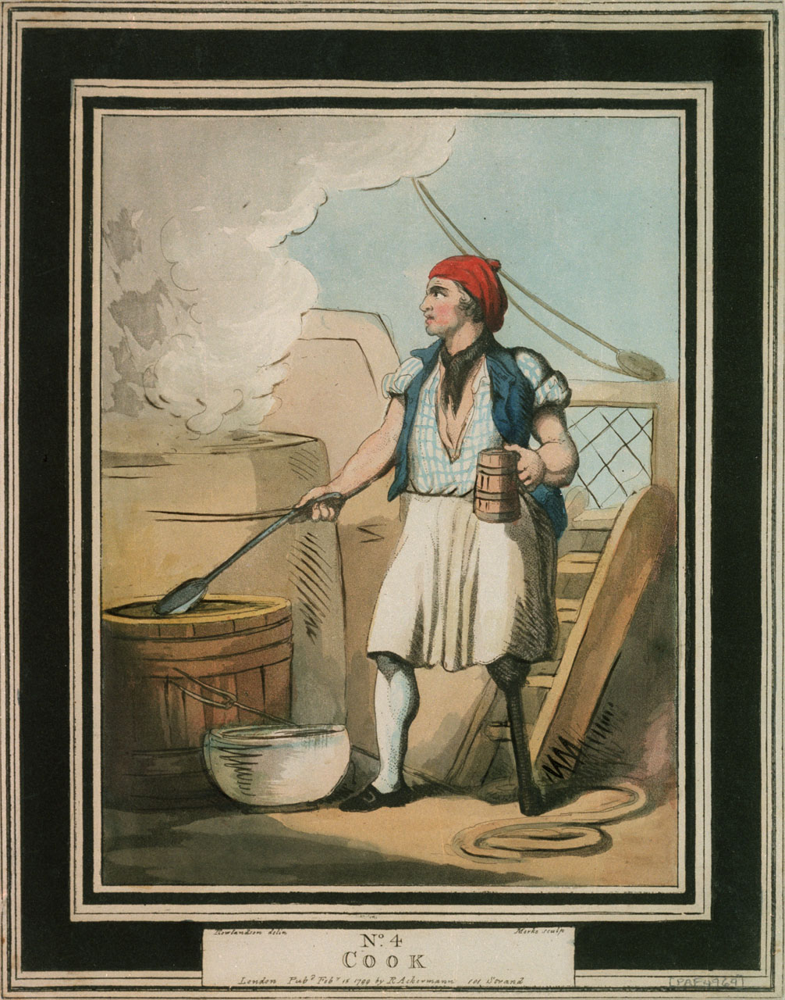
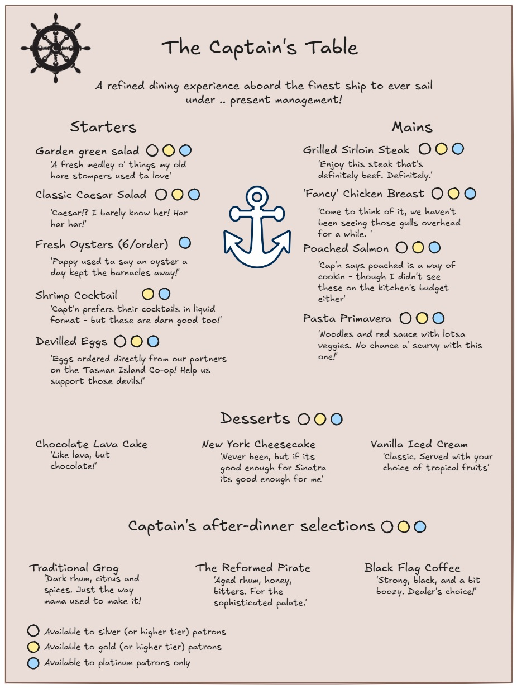

```{r setup, include = FALSE}
library(knitr)

options(
  pillar.width = 80,
  pillar.subtle = FALSE,
  pillar.min_chars = 3
)

opts_chunk$set(
  collapse = TRUE,
  echo = TRUE,
  warning = FALSE, 
  message = FALSE,
  width = 80
)

options(width = 80)

library(pacman)
library(tidyverse)

```

Welcome back!

You finished the last module on quite a cliffhanger!

In this module, we're going to dive a little deeper into the mystery illnesses aboard the **S. S. Rainbow Cake**, and learn some nifty ways to report our results!

### Learning objectives

By the end of Module 4, you will be able to

1.  Calculate common outbreak statistics based on food exposure data
2.  Create attractive tables using the **flextable** package
3.  Create a convenient report using markdown language

## Scenario update

At the end of the last module, we saw that symptoms of **bloody stool** and **fever** appeared to be specific to passengers that had boarded the ship on February 9th, and primarily "Silver" cruise member status. After speaking to a few of the crew members, they let you know the following:

1.  A certain proportion of passengers boarded the ship the day prior to departure: the same time that the bulk of the ship's crew were arriving on board. As a result of lessened staff capacity, passengers who pre-boarded had access to reduced à-la-carte dining services only.
2.  Member status (e.g., Silver, Gold, and Platinum) provides certain benefits to passengers based on their membership status. The higher tiers enable access to certain amenities aboard the ship, including premium gym and spa services, dedicated guest services concierge, enhanced in-room comforts, and exclusive access to premium dining items.

You decide to talk to the ship's cook about menu items served on February 9th. Maybe something there is responsible for the illnesses observed? The staff point you in the direction of the galley of the S. S. Rainbow Cake, where you meet the head chef: **Sam Stewpot** (or 'Salty Sam' according to the crew).

{fig-alt="An image of a ships cook"}

You can't be certain, but something seems a little... off about Sam. Not what you expected, at least. Regardless, after speaking about the dining services offered on the evening of February 9th, you ask for information about the menu items offered, and recruit several members of the crew to interview passengers and record which menu items they ordered.

The first piece of information comes directly from Salty Sam, who proudly tells you that in addition to their culinary expertise, they in fact wrote up the menu themselves, complete with chef's notes.

{fig-alt="An image of a dinner menu"}

::: callout-info
You see that certain menu items are restricted to the higher tier memberships only. Will this change which food items you decide to include in your analysis? Why or why not?
:::

After a short time, you receive the following email from the ship's steward:

`Dear [ship's epidemiologist],`

`Please find attached the results of the interrogation, err, I mean interviewin' o' the passengers, as per yer request.`

`I'll be notin as well, the cap'n is a reel Kate Winslet fan, and was watchin' a film called Contaygeon last night. He says they had some real nice looking tables and reports that were getting passed around in that film, and would like it if you could pass him something ta make it easy to read and understand whats been going on.`

`Thanks,`

`Patrick the Steward`

------------------------------------------------------------------------

Another busy day ahead of you! Let's recap on what we need to do:

1.  First and foremost - we should check out this dataset provided to us containing food item exposures of the passengers who dined aboard the ship on February 9th. Given our strong clues that the ship experienced a point-source outbreak, we want to be sure that any implicated food items don't wind up on the menu again!
2.  The captain has requested an epidemiological update from you, in a nicely formatted report. Up until now, we've just been reading off the outputs provided in R, and while this is fine for us as a working-method, we should recognize that it is important to make sure our results and recommendations are as easy to interpret as possible. Therefore, we'll explore some ways to create custom, easy-to-read tables.
3.  (If we have time for it). We'll introduce R markdown documents - which can be used in a variety of ways to create nice, convenient reports that combine your code, outputs, and notes, all in one place!

## Part A: Exploring the food exposure dataset
