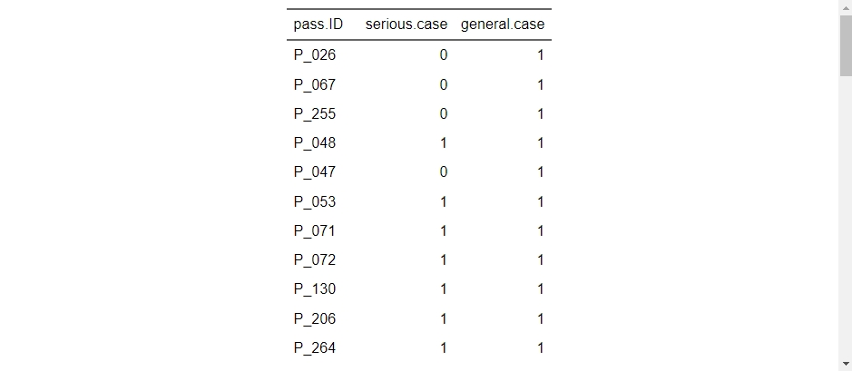

```{r setup, include = FALSE}
library(knitr)

options(
  pillar.width = 80,
  pillar.subtle = FALSE,
  pillar.min_chars = 3
)

opts_chunk$set(
  collapse = TRUE,
  echo = TRUE,
  warning = FALSE, 
  message = FALSE,
  width = 80
)

options(width = 80)

library(pacman)
library(tidyverse)

```

Welcome back!

You finished the last module on quite a cliffhanger!

In this module, we're going to dive a little deeper into the mystery illnesses aboard the **S. S. Rainbow Cake**, and learn some nifty ways to report our results!

### Learning objectives

By the end of Module 4, you will be able to

1.  Calculate common outbreak statistics based on food exposure data
2.  Create attractive tables using the **flextable** package
3.  Create a convenient report using markdown language

## Scenario update

At the end of the last module, we saw that symptoms of **bloody stool** and **fever** appeared to be specific to passengers that had boarded the ship on February 9th, and primarily "Silver" cruise member status. After speaking to a few of the crew members, they let you know the following:

1.  A certain proportion of passengers boarded the ship the day prior to departure: the same time that the bulk of the ship's crew were arriving on board. As a result of lessened staff capacity, passengers who pre-boarded had access to reduced à-la-carte dining services only.
2.  Member status (e.g., Silver, Gold, and Platinum) provides certain benefits to passengers based on their membership status. The higher tiers enable access to certain amenities aboard the ship, including premium gym and spa services, dedicated guest services concierge, enhanced in-room comforts, and exclusive access to premium dining items.

You decide to talk to the ship's cook about menu items served on February 9th. Maybe something there is responsible for the illnesses observed? The staff point you in the direction of the galley of the S. S. Rainbow Cake, where you meet the head chef: **Sam Stewpot** (or 'Salty Sam' according to the crew).

{fig-alt="An image of a ships cook from 1799." fig-align="left" width="503"}

You can't be certain, but something seems a little... off about Sam. Not what you expected, at least. Regardless, after speaking about the dining services offered on the evening of February 9th, you ask for information about the menu items offered, and recruit several members of the crew to interview passengers and record which menu items they ordered.

The first piece of information comes directly from Salty Sam, who proudly tells you that in addition to their culinary expertise, they in fact wrote up the menu themselves, complete with chef's notes.

{fig-alt="An image of a dinner menu" fig-align="left"}

You notice that certain menu items are restricted to the higher tier memberships only. Will this change which food items you decide to include in your analysis? Why or why not?

::: callout-note

#### Cruise ship outbreaks

By now, you've surely come to the conclusion that we're dealing with a fairly common occurrence related to cruises: outbreaks of gastrointestinal disease. Bringing together a variety of passengers and crew from from diverse regions aboard a semi-enclosed, often crowded vessel, where passengers are in frequent contact with new exposures is a perfect storm for the spread of disease. Further, the convenience and luxury of cruising makes it a favorite past-time for the elderly and family members who may be immunocompromised.

If you haven't already started guessing about what could be causing illness aboard the **S. S. Rainbow Cake**, have a read through the following resources, and reflect on the menu posted above. Are there any food items that you predict are likely to be the culprit just based on the frequency that they're implicated as sources of outbreaks? What pathogen are you the most suspicious about?

If you have experience with cruise-ship outbreaks, we encourage you to post on the course discussion boards and share your thoughts and opinions with your classmates. Conversely, if you have questions about cruise-ship outbreaks - try asking on the discussion board to leverage the experience within the virtual classroom.

We'll leave some resources here all about cruise-ship outbreaks for you to check out when you have time:

1.  [CDC Yellow Book: Cruise Ship Travel 2026](https://www.cdc.gov/yellow-book/hcp/travel-air-sea/cruise-ship-travel.html "CDC Yellow Book: Cruise Ship Travel 2026")
2.  [CDC Vessel Sanitation Program (VSP): Outbreaks on Cruise Ships in VSP's Jurisdiction (2025)](https://www.cdc.gov/vessel-sanitation/cruise-ship-outbreaks/index.html "Outbreaks on Cruise Ships in VSP's Jurisdiction (2025)")
3.  [Epidemiology of Diarrheal Disease Outbreaks on Cruise Ships, 1986 Through 1993](https://jamanetwork.com/journals/jama/article-abstract/396811?utm_source=chatgpt.com "JAMA article on Epidemiology of Diarrheal Disease Outbreaks on Cruise Ships from 1996")


:::

## Part A: Exploring and preparing the data

### Food exposures dataset

Let's start by exploring the food exposure data extract that was provided to us.

```{r}
foodexp <- read_tsv("participant_data/module4/foodexposures_feb9.txt")
```

::: callout-note
As you review the food exposures data, what do you notice about the values under each of the exposures? Are they a simple dichotomous value? How do you propose to work with these?

For your reference, the following responses were recorded:

-   **Y** = **Yes**, the passenger recalls eating the food item.
-   **N** = **No**, the passenger recalls specifically NOT eating the food item.
-   **P** = **Possibly**, the passenger recalls that they may have eaten the food item, either from their own plate or from a spouses or someone at the same table.
-   **DK** = **Doesn't know** or **doesn't recall**, the passenger does not recall whether they consumed the food item or not.
:::

You may choose to do differently for your analysis, but for our walk-through of this module, we'll use the following guidelines to recode these values into something we can use:

-   **1** = **Y or P**. Since there's a possibility that the passenger consumed the food item, we'll group them together with those who can confirm that they consumed they item. This approach may be slightly more sensitive than excluding them, but we'll accept that for now.
-   **0** = **N**. Only passengers who recall that they specifically did not consume the food item will be treated as a confirmed negative, since those with poor recall may have been exposed and not reported it.
-   **NA** = **DK**. Passengers without adequate recall are dropped from the calculations on that food exposure.

Let's go ahead recode the food exposures, then save this as a new object. Since we're performing the *exact same operation* across a number of variables (see what we did there?), then this is another perfect use-case for our new favorite function: `across()`!

Since we've already covered this function, take a minute to try to piece together how you would use mutate(), across(), and case_when() to recode all of the Y/N/P/DK values in the dataset. When you're finished, see how your code compares to ours below.

<details>

<summary><strong> Click to see the R code we used to recode the food exposures </strong></summary>

```{r}
foodexp_recoded <- 
foodexp %>% 
  mutate(
    across(
      gsalad:vanicecr, # This selects every variable in order from gsalad to vanicecr
    ~ case_when(
      .x == "Y" ~ 1, # We use the .x as a dummy for each variable
      .x == "P" ~ 1,
      .x == "N" ~ 0,
      .x == "DK" ~ NA_real_, # NA_real_ keeps the NA as an integer class
      TRUE ~ NA_real_
    )
    )
    )

```

</details>

Great! Now that you've got this dataset recoded and have spent a minute reviewing the data, you'll notice that the food exposures data includes all the passengers who dined onboard the ship on February 9th and doesn't differentiate between ill and healthy passengers.

We'll want to develop a case definition using the reported symptoms so that we can determine who got sick, and what they ate. In order to do this, we'll require the symptoms dataset from Module 3, however we'll introduce a simplified version that already has the variables created that we need.

### The symptoms dataset

These data should look quite familiar to you after completing Module 3, however, we've removed some variables and provided a simpler version of the dataset for you to work with in Module 4. Read the data into your R instance and review the structure and contents.

```{r}
symptoms <- read_tsv("participant_data/module4/symptoms_feb14.txt")
```

As you can see, the symptoms dataset has been simplified from the previous module, and already contains a variable for fever. You'll need to use your skills from Module 3 to join this with the food exposures dataset, but first let's make a plan for what we want to do with these.

## Part B: Calculating attack rates

A common practice in foodborne outbreak epidemiology is calculating attack rates for menu items. A food-specific attack rate is a measurement of incidence proportion (or incidence risk) that is specific to a certain food item consumed during an event or otherwise defined time period. It includes the number of persons who **ate the food item of interest and became ill** in the **numerator**, and the **total number of persons who consumed the food item** in the **denominator**.

Before we can calculate attack rates from our food exposures information, we'll need to do two things.

1.  We'll want to join our symptoms and food exposures datasets using one of the joins that we practiced in Module 3. You'll notice in this module that we have datasets that are quite different in terms of the numbers of observations. You'll need to decide what you want to do with the additional passenger data in the food exposures dataset. You may elect to use a join type that either drops observations that do not have a match (i.e., left join, right join, inner join) or use one that keeps all observations (e.g., full join) and filter/perform calculations accordingly.

2.  We'll also need to figure out who we consider as ill from our symptoms dataset, in other words, we'll want to make a **case definition**. We saw in Module 3 that our symptoms dataset included individuals with dates of illness onset from February 10th up to February 14th, and that some individuals had worse symptoms than others (e.g., bloody stool and fever). For our analysis here, let's start by just including **all passengers aboard the S. S. Rainbow Cake**, with **symptoms of bloody stool OR fever**, **symptom onset dates between February 9th and 14th**, and who **attended the à-la-carte meal service on the evening of February 9th**.

Alright, let's start getting into the data then! Since we've spent so much time practicing these operations already - we'd like you to try your hand at the R code by yourself first. If you get stuck, or finish and want to compare to how we did things - click the drop-down to see our code.

Think about the two operations that we just listed above, and how, and in what order you would go about doing these. Remember, there's really no wrong answer to how you decide to code things - over time, everyone develops their own personal style for what works best for them. If you're not sure whether you're doing things in a sensible way, or you're worried someone won't be able to follow your code, then just use lots of #comments so its easy to figure out later!

<details>

<summary><strong> Click to see how we joined the tables and created a case definition </strong></summary>

We're actually going to start with the symptoms dataset, and create our case definition first, then drop the additional symptom variables that we don't need before joining with the food exposures dataset. Let's create one case definition for the more serious symptomatic passengers (bloody stool OR fever), and then a general case definition for anyone reporting symptoms. Then we'll drop the additional variables, and join with the food exposure dataset.

```{r}
symptoms_def <- 
  symptoms %>% 
  mutate(serious.case = 
           case_when(
             bloody.stool == 1 ~ 1,
             fever == 1 ~ 1,
             TRUE ~ 0),
         general.case = 1) %>%
  select(pass.ID, serious.case, general.case)

```

Alright, now that we've got a simplified dataset with just the cases identified who meet the general versus serious case definitions, let's join this with the food exposure dataset. Its going to be useful to us to know the how many passengers got sick as well as didn't get sick from different food items on the night of February 9th.. so we'll want to use a join that keeps all observations from the food exposures dataset whether or not they match to the symptomatic passengers.

Now, simply using a left\_ or right\_ join will work fine, so long as you are careful about the *order* of the datasets that you input. For example, if you were to use a left join and list the symptoms_def dataset first, then the resulting joined table will only contain observations that were found in the symptoms_def dataset. Conversely, if you used the same left join and listed the food exposures datset first, then the result would keep all observations from the food exposure dataset, and just return NA's wherever there wasn't a match.

To keep our lives simple, we'll apply a full_join, which will keep all observations from both tables regardless of the order.

```{r}

food_symp_joined <- 
foodexp_recoded %>% 
  full_join(symptoms_def, by = c("PersonID" = "pass.ID"))

```

</details>

Great! Now we have a dataset we can use to start calculating attack rates of food items!

So, in simple terms, the food-item specific attack rate is the number of passengers who ate the item and got sick divided by the total number of passengers who ate the item. This is simple enough on paper, but will take a little bit of logic to implement the code - something we've actually already practiced a lot in this course using the case_when() function!

Since we have **two** variables we're working with for each calculation in this instance (i.e., consumed food item, case status) we'll need to include **both** inside our sum() function when counting up the cases. We'll use **Boolean logic** to do this, and apply the **AND** operator (`&`).

::: callout-note
### George Boole and Boolean Logic

[{fig-alt="An artists portrait of mathematician George Boole (1815-1864)" fig-align="center" width="480"}](https://en.wikipedia.org/wiki/George_Boole)

Boolean logic (or Boolean Algebra) was developed by an English mathematician named George Boole who lived during the 19th Century. The key idea behind Boolean logic that we use in programming is that statements can be made to evaluate into a dichotomous outcome: **TRUE** or **FALSE**. This allows us to evaluate many complex statements and simplify them into a single YES/NO answer.

In R, the main operators that we use to evaluate Boolean expressions are the following:

-   `&` AND
-   `|` OR
-   `!` NOT

On their own, these operators aren't particularly impressive, but we can combine them with the following **comparison operators** to chain some complex statements together.

-   `==` EQUAL (or EQUIVALENT) TO
-   `!=` NOT EQUAL (or EQUIVALENT) TO
-   `<` LESS THAN
-   `>` GREATER THAN
-   `<=` LESS THAN OR EQUAL TO
-   `>=` GREATER THAN OR EQUAL TO

For example, a case that is **GREATER THAN OR EQUAL TO** to 33 years of age, **AND** has eaten the potato salad, **AND** has reported fever **OR** bloody stool might look something like this:

`(age >= 33) & (psalad == 1) & (fever == 1 | bstool == 1)`

Feeling like you just haven't quite had enough Boolean logic for one day? Check out the chapter on [Logical Vectors from the R for Data online textbook!](https://r4ds.hadley.nz/logicals.html "Link to R4DS chapter on Logical Vectors")
:::

Let's use summarise() to try out our Boolean logic within the sum() function using just the first food item, and the **general** case definition. Then we'll test to make sure things are working correctly.

```{r}
food_symp_joined %>% 
  summarise(gsalad_AR1 = sum(gsalad == 1 & general.case == 1, na.rm = TRUE) / sum(gsalad == 1, na.rm = TRUE))
```

According to our calculations, the green salad had an attack rate of approximately 17% for serious symptom outcomes. Let's take a minute though to stop and double check that the calculations are correct. Sometimes using statements with multiple logic operators can get tricky - so it's always good practice to stop and verify that things are working as intended.

As we learned earlier, the attack rate numerator should be the number of passengers who reported consuming the food item who got sick. So with this in mind let's check how many individuals that equals by using a different approach and seeing if the numbers come out the same.

We'll start by calculating the numerator just using tidyverse filter() functions, and count() the number of rows left over. We'll filter for both serious cases only, then the number of individuals within those that reported green salad exposure.

```{r}
# numerator
food_symp_joined %>% 
  filter(general.case == 1) %>%
  filter(gsalad == 1) %>% 
  count()

```

Great, so our numerator should be 21. Now let's check the denominator: the number of total individuals who consumed the reported food item.

```{r}
# denominator
food_symp_joined %>% 
  filter(gsalad == 1) %>% 
  count()


```

Our denominator should be 121. Now, manually calculate the attack rate of 21/121: fingers crossed we get the same result!

```{r}
#Green salad attack rate
21 / 121

```

Phew! Double checking our calculation ended up with the exact same result, thankfully! It looks like our Boolean logic expression is working just fine. Now we can use the same syntax to calculate the attack rate for general illness of all the food items and see if there are any that stand out as being particularly risky.

Starting with the code that we worked through above, calculate the attack rate of all the food menu items for **general illnesses**. Feel free to use either long-form, and write out a new line for each food item, or go back and review earlier in this module, as well as **Module 3** where we practiced with using **across()** within the **summarise()** function, and try to work out how to do the calculations all in one go! Note: when we used **across()** previously, we were calculating based on multiple input variables only, and not outputting multiple variables. You may need to [check the documentation](https://dplyr.tidyverse.org/reference/across.html "Documentation for the across() function.") to read up on how to do this!

<details>

<summary><strong> Click to see the R code </strong></summary>

Method 1: long form

```{r}
food_symp_joined %>% 
  summarise(gsalad_AR = sum(gsalad == 1 & general.case == 1, na.rm = TRUE) / sum(gsalad == 1, na.rm = TRUE),
            csalad_AR = sum(csalad == 1 & general.case == 1, na.rm = TRUE) / sum(csalad == 1, na.rm = TRUE),
            oyster_AR = sum(oyster == 1 & general.case == 1, na.rm = TRUE) / sum(oyster == 1, na.rm = TRUE),
            shcocktl_AR = sum(shcocktl == 1 & general.case == 1, na.rm = TRUE) / sum(shcocktl == 1, na.rm = TRUE),
            deggs_AR = sum(deggs == 1 & general.case == 1, na.rm = TRUE) / sum(deggs == 1, na.rm = TRUE),
            ssteak_AR = sum(ssteak == 1 & general.case == 1, na.rm = TRUE) / sum(ssteak == 1, na.rm = TRUE),
            fcbreast_AR = sum(fcbreast == 1 & general.case == 1, na.rm = TRUE) / sum(fcbreast == 1, na.rm = TRUE),
            pchsalmon_AR = sum(pchsalmon == 1 & general.case == 1, na.rm = TRUE) / sum(pchsalmon == 1, na.rm = TRUE),
            ppasta_AR = sum(ppasta == 1 & general.case == 1, na.rm = TRUE) / sum(ppasta == 1, na.rm = TRUE),
            choclava_AR = sum(choclava == 1 & general.case == 1, na.rm = TRUE) / sum(choclava == 1, na.rm = TRUE),
            nycake_AR = sum(nycake == 1 & general.case == 1, na.rm = TRUE) / sum(nycake == 1, na.rm = TRUE),
            vanicecr_AR = sum(vanicecr == 1 & general.case == 1, na.rm = TRUE) / sum(vanicecr == 1, na.rm = TRUE))
```

Method 2: using across()

```{r}

food_symp_joined %>% 
  summarise(
     across(
       gsalad:vanicecr,
       ~ sum(.x == 1 & general.case == 1, na.rm = TRUE) /
           sum(.x == 1, na.rm = TRUE),
       .names = "{.col}_AR"
     )
   )

```

</details>

After reviewing the attack rates of each food item - are there any that stand out as particularly risky to you? Repeat the analysis using the serious illness case definition and compare your results. What are your best epidemiological recommendations at this time? Are there other analyses that you would want to complete to be more confident in your assertions?

## Part C: Flexing your R expertise

After working through your calculations for the food exposures, you receive the following email from the ship's steward:

> Dear \[ship's epidemiologist\],
>
> The cap'n sends his regards and hopes you found the results o' the passenger ~~interrogation~~ -- I mean interviewin' .. helpful.
>
> I'll be notin as well, the cap'n is a reel Kate Winslet fan, and was watchin' a film all about your profession last night. He says they had some real nice looking reports that were getting passed around in that film, and would like it if you could pass him something ta make it easy to read and understand whats been going on.
>
> Thanks,
>
> Patrick the Steward

As if you didn't have enough things to worry about, the captain has requested an epidemiological update from you, in a nicely formatted report. As much as this is extra work on your plate - the captain and his steward, Patrick, have touched on something really important in public health: if you can't easily translate the information and evidence that you've gathered, then what was the point in collecting it in the first place? The job of an epidemiologist is only one piece of the larger puzzle that goes into serving public health, and we need to make sure that the information and messaging that we provide is as clear as possible to those working in other disciplines - whether that be physicians, administrators, or deck swabbers!

Up until now, we've just been reading off the outputs provided in R, and while this is fine for us as a working-method, we should recognize that it is not very accessible for those that haven't had specialized training in these areas. Therefore, we'll explore some ways to create custom, easy-to-read tables for our results!

### Introducing Flextable

The flextable package provides a useful framework for working with tables that are intended to be read by human eyes (or eye, in the case of some of the patch-wearing crew members aboard the **S. S. Rainbow Cake**!). While not a *core* tidyverse package, flextable is considered part of the wider tidyverse, which means it works seamlessly with all the functions that we've discussed to date. However, we must load it separately in addition to our usual call to load the tidyverse library.

```{r}

p_load(flextable)

```

The flextable() function uses a **data frame** as input, and returns a **flextable** object. This means that simply writing out a statement like:

> flextable(symptoms)

will return a default table that, while not perfect, is already a lot easier to incorporate into reporting than the standard R outputs (see below).

{fig-alt="An image of a table containing passenger ID and case status"}

### Building a table of attack rates

We recently just produced an output of the attack rates of different food items, but as you saw, the results weren't very pretty, and were poorly formatted to include in any kind of report or email that would could share with others. Instead of going through the painstaking process of drafting a table in a word processing software and manually copying over the values, let's instead put our efforts into automating a nice flextable that we can then export to use directly in a report.

#### Formatting the data for use in a table

First, we'll start by revisiting the attack rate table that we created earlier.

```{r}
  food_symp_joined %>% 
  summarise(
     across(
       gsalad:vanicecr,
       ~ sum(.x == 1 & general.case == 1, na.rm = TRUE) /
           sum(.x == 1, na.rm = TRUE),
       .names = "{.col}_AR"
     )
   )

```

You'll notice that the table is in wide-format. This isn't great for readability, so lets first pivot it into long format using pivot_longer().

```{r}

food_symp_joined %>% 
  summarise(
    across(
      gsalad:vanicecr,
      ~ sum(.x == 1 & general.case == 1, na.rm = TRUE) /
        sum(.x == 1, na.rm = TRUE),
      .names = "{.col}_AR"
    )
  ) %>%
  pivot_longer(
    cols = everything(),
    names_to = "Menu Item",
    values_to = "Attack Rate"
  )

```

Great - that's exactly what we wanted! A column of menu items, and a column of their attack rate for illness. Let's save this as an object before moving on to more complex tasks. Since attack rates are usually expressed as a percent, we'll add a line in to multiply that column by 100 too.

```{r}

# Save table as object called ar_table
ar_table <- food_symp_joined %>% 
  summarise(
    across(
      gsalad:vanicecr,
      ~ sum(.x == 1 & general.case == 1, na.rm = TRUE) /
        sum(.x == 1, na.rm = TRUE),
      .names = "{.col}_AR"
    )
  ) %>%
  pivot_longer(
    cols = everything(),
    names_to = "Menu Item",
    values_to = "Attack Rate"
  ) %>%
  mutate(
    `Attack Rate` = `Attack Rate` * 100
  )
  


```

Now that we have our attack rate table in a basic format that works, we can start applying changes to make it more attractive and legible. Let's start out by changing the food item names from the codified versions we used back into the menu items to make them more understandable.

```{r}

#Update the table using mutate() and recode() the entries in the `Menu Item` variable.

ar_table <- ar_table %>% 
  mutate(
    `Menu Item` = recode(
      `Menu Item`, #need to specify which variable to recode in first argument
      gsalad_AR    = "Green Salad",
      csalad_AR    = "Caesar Salad",
      oyster_AR    = "Raw Oysters",
      shcocktl_AR  = "Shrimp Cocktail",
      deggs_AR     = "Deviled Eggs",
      ssteak_AR    = "Sirloin Steak",
      fcbreast_AR  = "Fancy Chicken Breast",
      pchsalmon_AR = "Poached Salmon",
      ppasta_AR    = "Pasta Primavera",
      choclava_AR  = "Chocolate Lava Cake",
      nycake_AR    = "New York Cheesecake",
      vanicecr_AR  = "Vanilla Ice Cream"
    )
  )

```

Excellent! Now that we have the foundation of our flextable, we can go ahead and save this code to a flextable object.

```{r}

ft_ar <- flextable(ar_table)

```

Now you've got your data saved as a flextable object, which by itself works very well with documents in MS Word, or PDF, and also allows for lots of attractive formatting options!

::: callout-important
Did you see what we did there? By simply wrapping that whole chunk of code from earlier inside the flextable() function and saving it as an object, we were able to easily create a flextable object. We think its worthwhile to stop for a second, however, and take note of what that small piece of code represented. You had to start with two separate datasets, clean and prepare them for joining, merge them together, manipulate and calculate new metrics, summarise, pivot into a longer format, and relabel - all before wrapping the code in the flextable function.

As you face more complex R operations in the future, you'll find that large complex problems can **always** be broken down into smaller ones. When faced with a coding task that you're unsure how to complete - start with the small things that you DO know how to do, and work up from there. You'd be surprised at how much you can accomplish when you just take things one piece at a time!
:::

#### Working with a flextable object

Now that we have our basic flextable made up, let's turn to some of our formatting options within the package to make the table a little nicer looking.

We'll use argument `colformat_double` to set the formatting options of the *Attack Rate* column. Let's go ahead and set the number of decimal places to 1 using `digits =`, and attach a percent (%) sign to the values in that column using the `suffix` argument.

Then, we'll embolden the header using `bold()`, and ask flextable to automatically fit the column widths to the data using the `autofit()` function.

```{r}

ft_ar %>% 
  colformat_double(
    j = "Attack Rate",
    digits = 1,
    suffix = "%"
  ) %>% 
  bold(part = "header") %>% 
  autofit()

```

Excellent!

We now have a very nice looking table that can be easily added to a report! And we've really only scratched the surface of making nice tables in R with flextable. Take a look at some of the examples in the [flextable gallery](https://ardata.fr/en/flextable-gallery/ "Examples of tables made using the flextable package") if you're ever seeking inspiration.

While we only used very basic options in flextable, there are seemingly endless applications and extensions to the package. Take a few minutes to explore some further options for formatting your flextable using the documentation [here](https://ardata-fr.github.io/flextable-book/index.html "Using the flextable package"), as well as leveraging your favorite AI tool for ideas and help.

Finally, if you'd like a cheatsheet as a quick reference for flextable, you can also download one [here](https://ardata-fr.github.io/flextable-book/static/pdf/cheat_sheet_flextable.pdf "Download flextable cheatsheet!").

### Now it's your turn!

Remember back in Part A when we created two different case definitions? We purposefully worked through the example with flextable using only the **general** illness case definition, but did not include the **severe illness** case definition.

Your task now, is to go back, and create a flextable that looks like the one above, but includes a total of three columns:

1.  Menu item
2.  General illness AR
3.  Severe illness AR

You will need to go back, add a variable for food-specific attack rates for the severe illness AR, then reuse the code to create a flextable containing both attack rates.

In the end, you should produce something that looks like the following:

```{r echo=FALSE}

food_symp_joined %>% 
  summarise(
    across(
      gsalad:vanicecr,
      ~ sum(.x == 1 & general.case == 1, na.rm = TRUE) /
          sum(.x == 1, na.rm = TRUE),
      .names = "{.col}_AR_general"
    ),
    across(
      gsalad:vanicecr,
      ~ sum(.x == 1 & serious.case == 1, na.rm = TRUE) /
          sum(.x == 1, na.rm = TRUE),
      .names = "{.col}_AR_serious"
    )
  ) %>%
  pivot_longer(
    everything(),
    names_to = c("menu_item", "AR_type"),
    names_pattern = "(.*)_AR_(.*)",
    values_to = "attack_rate"
  ) %>%
  pivot_wider(
    names_from  = AR_type,
    values_from = attack_rate
  ) %>% 
    mutate(
    `menu_item` = recode(
      `menu_item`, #need to specify which variable to recode in first argument
      gsalad    = "Green Salad",
      csalad    = "Caesar Salad",
      oyster    = "Raw Oysters",
      shcocktl  = "Shrimp Cocktail",
      deggs     = "Deviled Eggs",
      ssteak    = "Sirloin Steak",
      fcbreast  = "Fancy Chicken Breast",
      pchsalmon = "Poached Salmon",
      ppasta    = "Pasta Primavera",
      choclava  = "Chocolate Lava Cake",
      nycake    = "New York Cheesecake",
      vanicecr  = "Vanilla Ice Cream"
    )
  ) %>% 
  mutate(
    general = general*100, 
    serious = serious*100
  ) %>% 
  rename(
    `Menu Item` = "menu_item", 
    `AR General` = "general",
    `AR Serious` = "serious"
  ) %>% 
  flextable() %>%
    colformat_double(
    j = c("AR General", "AR Serious"),
    digits = 1,
    suffix = "%"
  ) %>% 
  bold(part = "header") %>% 
  autofit()
  

```

## Part D: Putting it all together

The captain asked for a nice report - and that's what we're going to deliver!

In your `participant_data/module4` folder you should find a file called `SSRainbowCake_EpiSummary.Rmd`.

This is an RMarkdown document template that you can use to draft up a summary of the epidemiological investigation to date for the ship's captain.

You'll need to go back through your results from the previous modules to find the information to complete the different sections.

Your report should include at least 1 figure (the epidemiologic curve from Module 3) and 1 table (attack rate table from Module 4). Apart from that, feel free to be as creative as you like.

When you're finished, hit the knit button at the top of your RStudio window to compile your report into a PDF document that you can share with the captain of the **S. S. Rainbow Cake**.
